# AO Surgery Reference：胫骨远端入路

All approaches to the distal tibia

> AO Surgery Reference is a resource for the management of fractures,  based on current clinical principles, practices and available evidence.

---

###  1：远端胫骨的前内侧或前外侧入路
大多数胫骨pilon骨折最好从前侧入路，可以是前内侧或前外侧。前外侧骨折块的大小有助于确定最佳入路。如果它很大，并且其内侧骨折平面在内侧踝或附近，建议采用前内侧入路。如果前外侧骨折块较小，并且骨折更侧向地穿过关节边缘，则可以通过前外侧入路实现其复位。

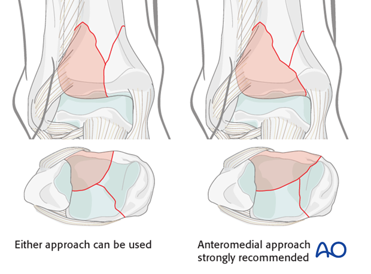

对于开放性骨折，通常观察到远端胫骨相关的横向内侧创伤性伤口（见插图），可能更倾向于前外侧手术入路，以最小化在内侧受创伤皮肤下方的额外解剖。同样，与外侧创伤性开放伤口相关的远端胫骨骨折可能最好从前内侧入路。在初次清创和外固定时，应考虑预期的ORIF切口，即使最终固定延迟到软组织恢复。

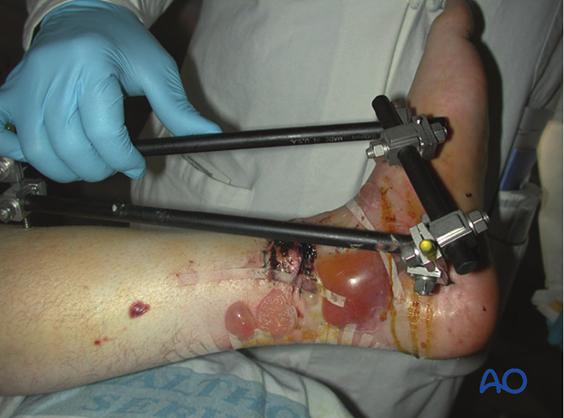

在3部分关节骨折中选择植入物取决于相关的干骺端粉碎、手术入路和软组织包膜，如前所述。相关的干骺端粉碎应在损伤X光片上考虑和评估。在弯曲骨折中，粉碎发生在失败的压缩侧。张力失败通常产生一个简单的横向骨折平面。

对于有内翻畸形的pilon骨折，通常观察到内侧干骺端粉碎，需要内侧支撑板和更强的内侧植入物。对于其应用，更倾向于前内侧入路。

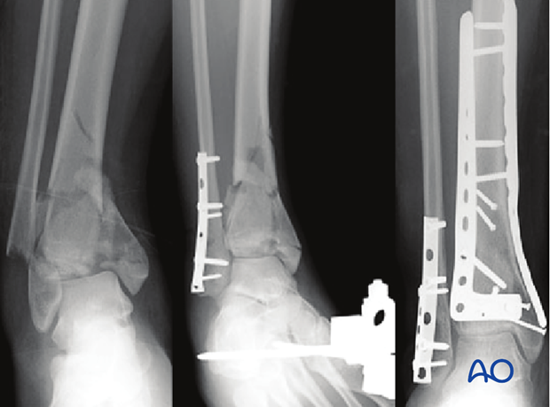

对于有外翻畸形的pilon骨折，通常观察到外侧干骺端粉碎，并且内侧远端胫骨通常在张力下失败。在这些模式中，外侧或前外侧支撑是最佳的，内侧固定可以更弱。

因此，对于具有显著初始外翻和/或前外侧干骺端粉碎的pilon，前外侧入路允许最佳地放置支撑板。

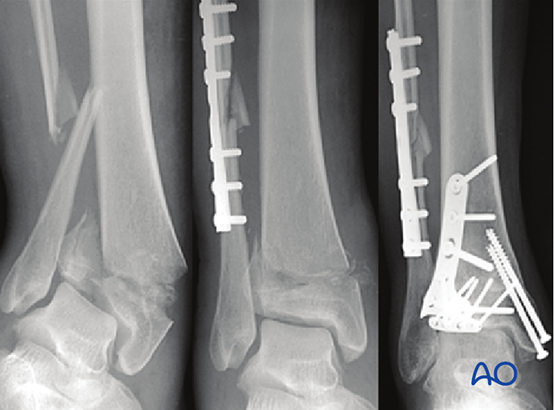

有多种常见的关节损伤增加了从上述3部分损伤描述的完全关节骨折的复杂性。这些包括关节粉碎和冲击的存在。冲击通常在中央和内侧看到。

关节表面冲击是重要的识别和纠正。必须通过选择的手术入路直接进入冲击区域。

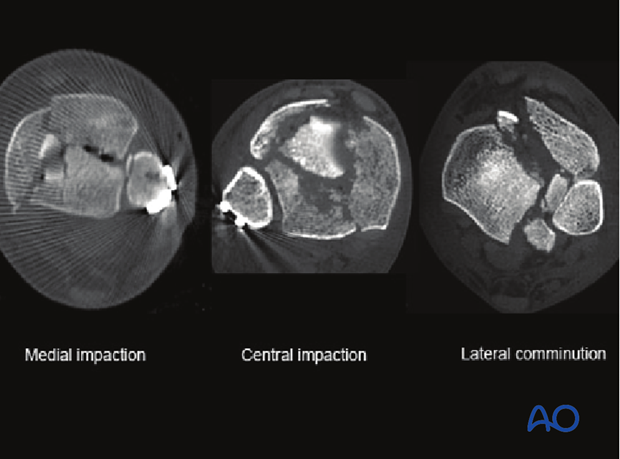

在以内翻畸形为主的pilon骨折中，经常可以看到内侧粉碎和冲击。两个典型位置在内侧踝的外侧和前外侧骨折块的内侧。

通过前内侧入路可以最佳地观察到内侧关节粉碎。除了复位相关的内侧踝粉碎外，这种方法还允许复位前外侧骨折块内侧看到的冲击。

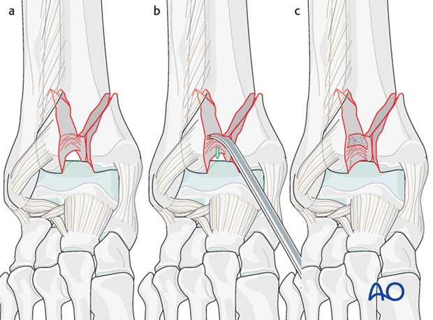

在以外翻畸形为主的pilon骨折中，经常可以看到外侧粉碎和冲击。外侧关节粉碎可以通过前内侧或前外侧入路。可视化可能在前外侧入路最佳，允许前外侧骨折块的外旋和直接复位相关的粉碎。

###  2：远端胫骨的前外侧入路
前外侧入路适用于：

- 许多完全关节pilon骨折
- 前侧和前外侧部分关节pilon骨折
- 一些用皮下前室板固定的额外关节远端胫骨骨折

前外侧入路提供了极好的可视化胫骨关节表面，直至内侧踝，同时避免了前内侧胫骨面的解剖。它非常适合精确的关节复位，以及跨越干骺端粉碎的皮下和皮下板应用。然而，对内侧踝关节的访问很差，近端延伸有限。优点还包括良好的软组织覆盖，能够到达胫骨和腓骨，如果有内侧开放性伤口。

三个X光视图显示了远端胫骨完全关节骨折

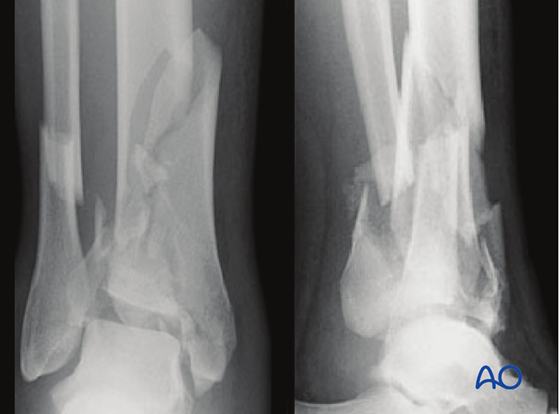

插图显示了部分关节远端胫骨骨折。

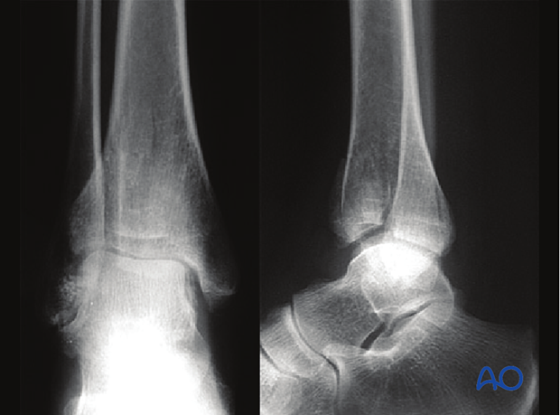

这个切口以踝关节为中心，远端与第四跖骨平行，近端与胫骨和腓骨之间平行。应通过皮肤和皮下组织进行锐性解剖，保持全厚皮瓣。由于前室肌肉起源于前腓骨，切口通常不超过踝关节上方七厘米。远端，切口可以延伸至距舟关节。

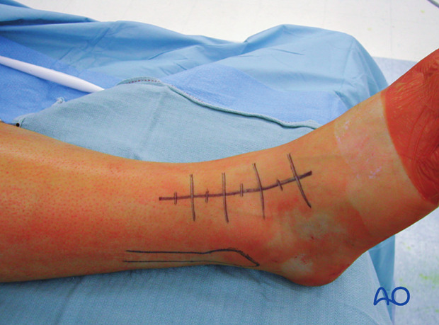

注意不要损伤位于皮肤下方的浅腓神经。该神经总是在踝关节上方穿过手术切口。应该识别、移动并在整个手术过程中保护它。

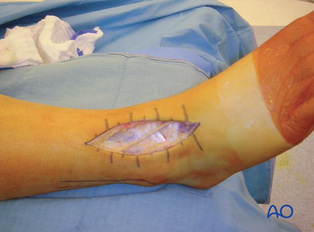

在浅腓神经下方锐性切开远端胫骨前室的筋膜。远端，切开伸肌支持带，将前室肌腱全部向内牵开。近端，然后可以移动并牵开整个前室肌肉，包括第三腓骨肌，向内牵开。这些肌肉和肌腱通常很容易从下面的前胫腓韧带、远端胫骨的骨膜和关节囊上移动。

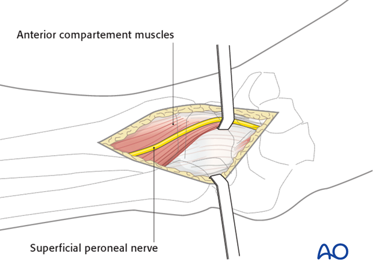

可以切开趾长伸肌的筋膜，小心解剖并牵开肌肉。这允许暴露距骨颈以进行针放置和牵引器应用。正确定位关节切开，预先计划在骨折上方，对于避免不必要和破坏性的骨折碎片去血管化至关重要。近端，解剖受到前室肌肉起源于腓骨和骨间膜的限制。

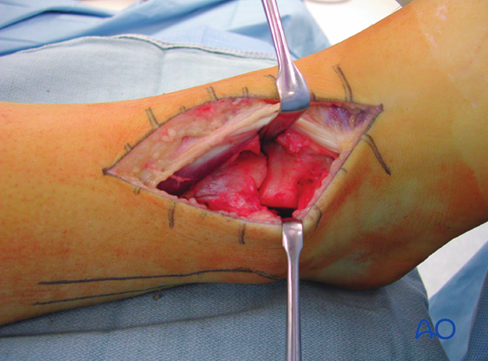

### 牵引器的应用
术中应用牵引器有助于关节可视化。此外，牵引器有助于对齐几个主要的关节骨折块。在距骨颈横向放置4毫米Schanz针，从外侧到内侧穿过手术切口。

第二个4毫米Schanz针从外侧到内侧放置在胫骨上，位于预期板应用的近端。针放置在距骨颈，位于距骨旋转轴的前方，将产生踝关节牵引和背屈，最大化关节可视化。小牵引器的螺纹杆放置在后外侧，以避免干扰复位和植入物放置。

###  3：远端胫骨的前内侧入路
前内侧入路适用于许多涉及关节面的骨折类型，特别是如果也涉及内侧踝。

如果尊重正确的时间，通常在初次创伤后5-10天，这是一个安全的程序。皮肤必须起皱，表明手术的正确时间。

为了防止术后皮肤坏死，重要的是不要破坏内侧和任何外侧入路之间的皮肤桥，避免侵犯前胫骨腱鞘。

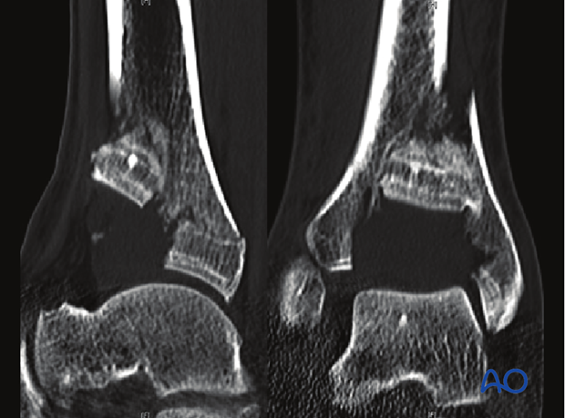

前内侧入路具有极佳的可视化关节面在内侧和中央部分，包括整个内侧踝的优势。要访问前外侧骨折块（Tillaux-Chaput），可能需要一个小的、单独的前外侧切口。

这种方法用于开放性还原和内固定胫骨的关节部分。它有助于精确的关节复位，结合皮下和皮下板应用。通常用于从远端到近端插入板，以桥接干骺端骨折区域（有限ORIF和MIO的组合）。患者处于仰卧位，近端切口无限延伸，但通常不需要。

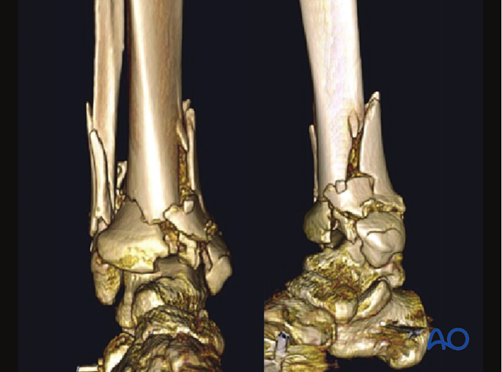

前内侧入路的切口从踝关节上方5-8厘米开始，就在可触及的胫骨嵴的外侧。它直线穿过踝关节，朝向舟骨基部，沿着前胫骨腱的内侧边缘。直线切口比曲线切口更好地接近胫骨的前部。

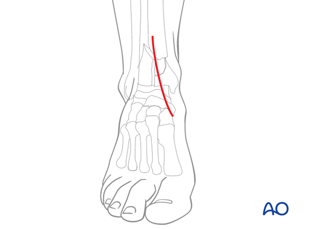

解剖通过骨膜，就在前胫骨腱的内侧加深。保持腱鞘完整至关重要，并立即修复任何创伤性或无意的破坏，这些破坏使肌腱直接暴露。可以以MIO方式滑动内侧板。

最小暴露和仔细处理骨膜至关重要，以防止进一步的血管损伤骨折碎片。

在腱鞘的后缘和骨膜之间进行侧向解剖，以获得减少前外侧骨折块的访问。然而，对于固定（螺钉插入），可能需要一个单独的小前外侧切口。

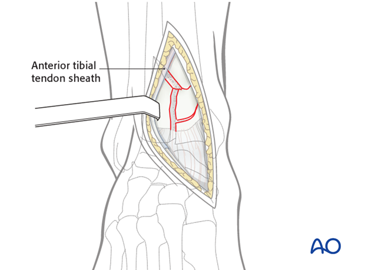

胫距关节沿矢状方向开放，通常与两个主要前关节骨折块之间的骨折线一致。

任何横向切口的前囊进一步暴露关节应保持简短，因为这有风险使前碎片去血管化（由前胫动脉的分支供应）。

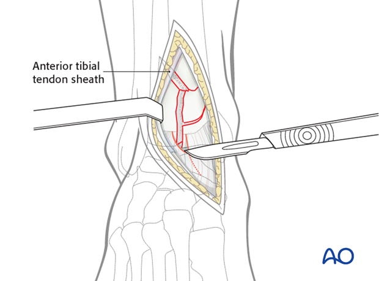

一个大的牵引器，从胫骨到内侧距骨，拉动距骨远端，有助于暴露。可以使用骨撑开器分离前内侧和前外侧关节骨折块。这暴露了关节，允许极佳的接近中心以及骨折的后部。

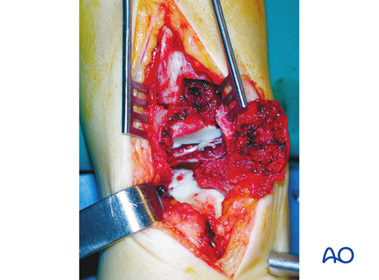

###  4：远端胫骨的后内侧入路
后内侧暴露允许直接复位后部和内侧骨折碎片。可以放置后板，有效地支撑后部碎片。如果需要，可以创建全厚皮下前内侧瓣以允许暴露和固定内侧踝。

这种方法允许直接支撑后部骨折碎片，并允许第二个前内侧切口如果需要。

切口以踝关节为中心，在跟腱和远端胫骨的后内侧边缘之间。近端切口与胫骨的后内侧边缘平行。远端切口与后胫骨腱的路径平行。

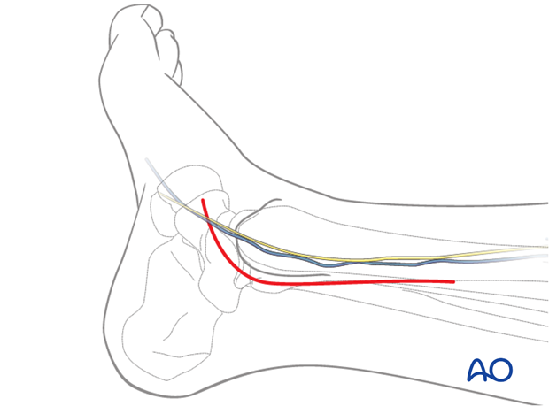

切口通过皮下脂肪和筋膜加深，深筋膜在胫骨后肌和长屈指肌的肌腱上，以及胫后神经血管束和长屈肌腱上显示。

对于访问远端胫骨的后内侧象限，需要仔细切开深筋膜近端，保护神经血管束。

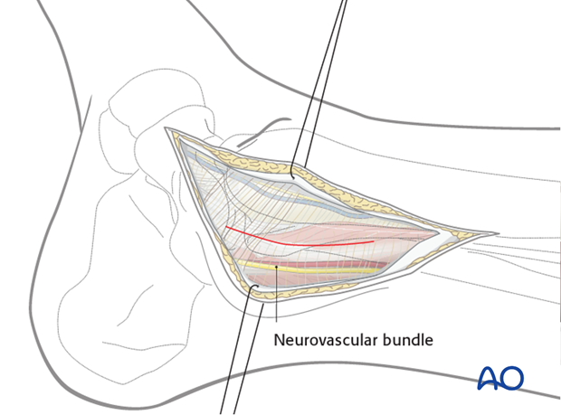

用于深解剖的间隔取决于主要骨折碎片的位置。它可能位于：

1）胫骨和胫后腱之间。这只对近端暴露有用，因为不应该从胫骨后部解剖远端胫后腱。

2）胫后腱和屈指长肌（见插图）之间。

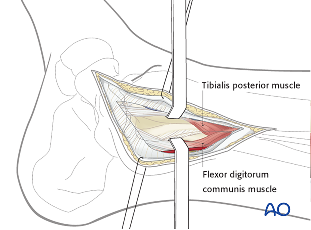

3）屈指长肌和长屈肌之间。这个间隔需要直接暴露和保护沿其长度的神经血管束。神经血管束可以向内前方或后外侧牵开。

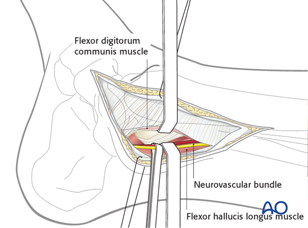

后内侧暴露允许直接复位后部和内侧骨折碎片。

可以放置后板，有效地支撑后部碎片。

如果需要，可以创建全厚皮下前内侧瓣以允许暴露和固定内侧踝。

多个深手术间隔可以根据骨折配置使用。

###  5：远端胫骨的微创入路
这种方法的关键概念是通过对干骺端骨折区域不进行手术暴露来保留软组织和血供。在远端胫骨上开发一个入口点。板从远端到近端插入，通过骨膜和完整覆盖组织之间的隧道。

MIO技术的标凈入路是内侧。然而，在选定的软组织损伤在内侧的病例中，可以使用前外侧入路。

这种MIO方法用于额外关节骨折，或简单、最小移位的完全关节骨折。在后者中，关节骨折组分没有暴露，并通过间接操作使用韧带牵引，或通过经皮还原钳，或直接通过经皮插入的拉力螺钉进行复位。

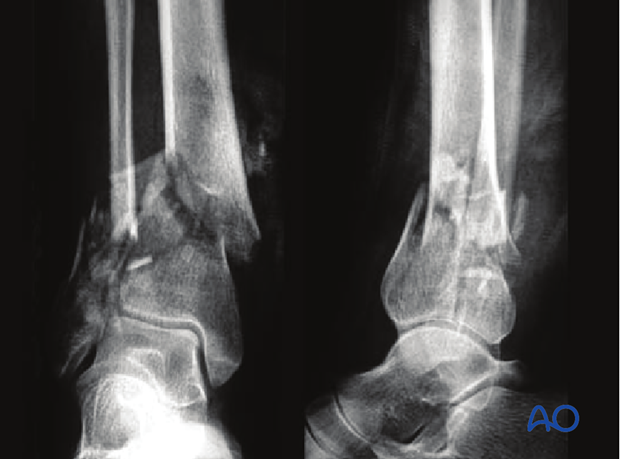

### 教学视频

_AO教学视频：MIO胫骨，远端_

_内侧入路_

在远端胫骨的内侧进行直线或略微弯曲的皮肤切口。切口的长度根据计划的板类型从3-5厘米不等。切口在内侧踝的尖端停止。

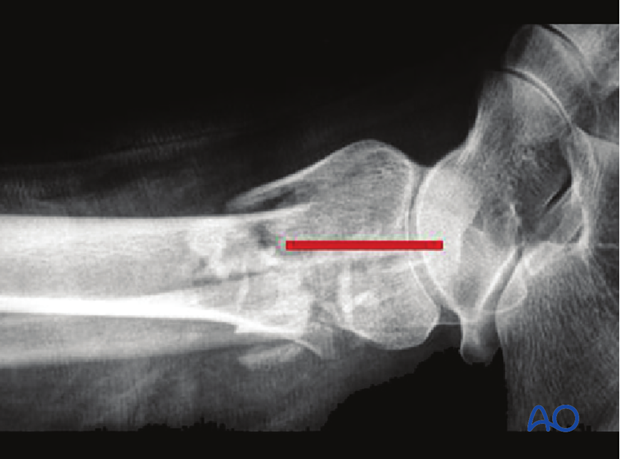

对于插入骨干的近端螺钉，通常单独的刺戳切口就足够了。

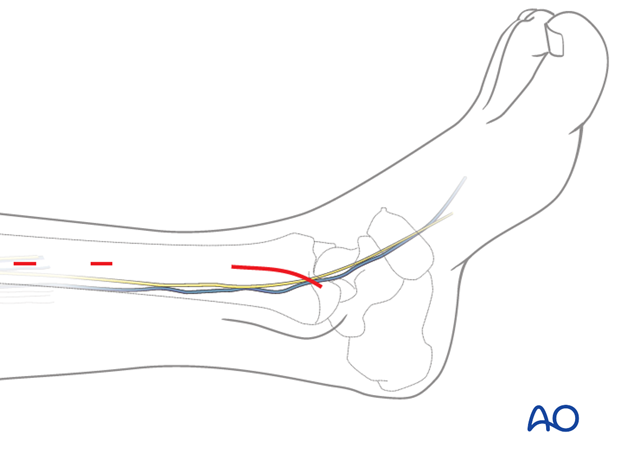

切口直接穿过皮下脂肪，保留大隐静脉和隐神经。它们应该用钝性牵开器向前牵开。

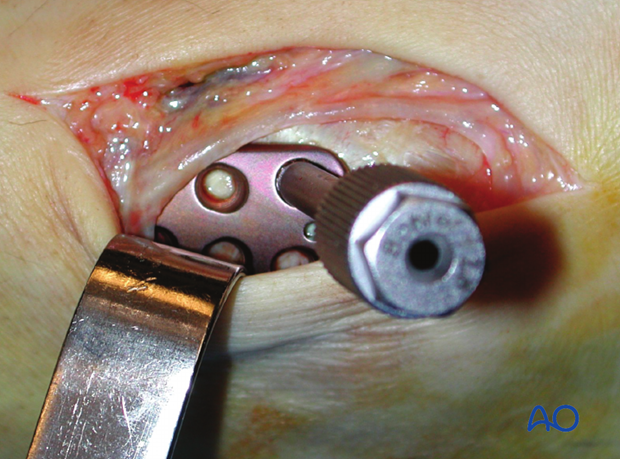

解剖向下推进到骨膜，完全保留。在这个解剖空间（骨膜上），通常可以很容易地用板的钝头在骨膜上进行隧道。

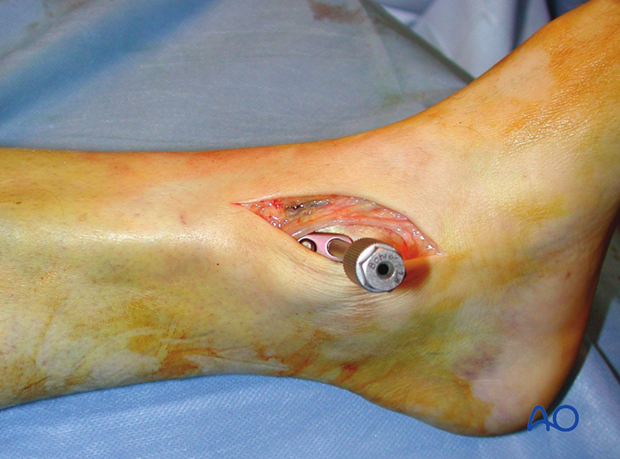

如果骨折延伸到内侧踝，可以在内侧踝关节上进行小关节切开，以帮助移除关节内骨软骨碎片，检查距骨穹窿的软骨表面，并直观评估内侧踝的复位。

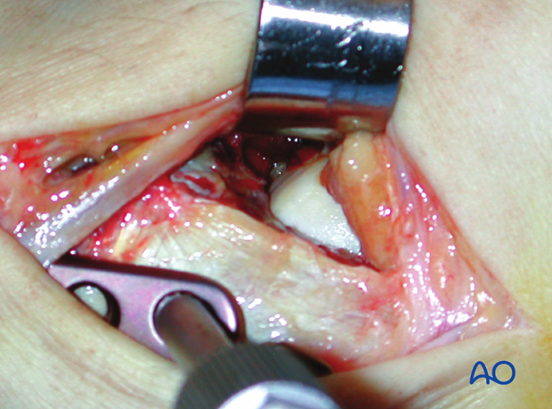

###  6：远端胫骨的内侧入路
在确定性固定胫骨关节面之前，需要解决手术肿胀。

直接内侧入路可用于垂直内侧分裂凹陷骨折，伴有关节冲击。然而，应该考虑将板直接放在内侧切口下的风险。或者，切口可以是前内侧。这些骨折经常有冲击和粉碎，骨折进入关节的地方。通常有一个独立的骨软骨碎片。此外，相邻的胫骨穹窿可能有冲击，必须抬起以获得解剖复位。

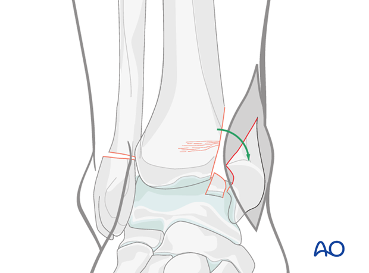

切口必须足够近端，以允许移位的骨折碎片并进入踝关节，以及复位碎片。

根据软组织的状况，切口可以近端延伸，以允许直接板应用到内侧胫骨（注意隐静脉和神经）。或者，切口可以限制在准确关节重建所需的暴露，然后是内侧胫骨近端的微创板技术。

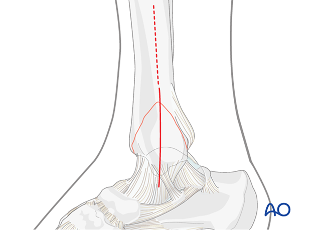

###  7：远端胫骨的后外侧有限开放入路
这种方法适用于主要位移的后胫骨骨折，前胫骨表面几乎没有或没有涉及的骨折模式。它的优点是允许通过同一切口固定腓骨和胫骨。当软组织损伤阻止使用前外侧或前内侧暴露时，它也很有用。患者被放置在俯卧或侧卧位。

皮肤切口沿着腓骨的后内侧边缘进行，可以从腓骨尖端延伸到需要的近端。它绝不应该比跟腱的外侧边缘更内侧。

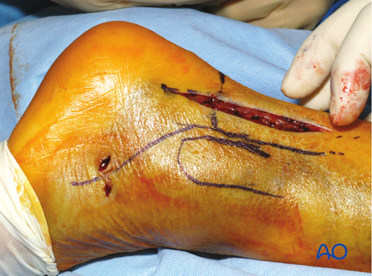

必须注意腓肠神经的走程，因为它从小腿后中线近端延伸到腓骨后侧远端。

腓肠神经在浅筋膜层下被识别，通常包括在外侧瓣中。如果解剖向近端延伸，可能需要在该神经的任一侧工作。

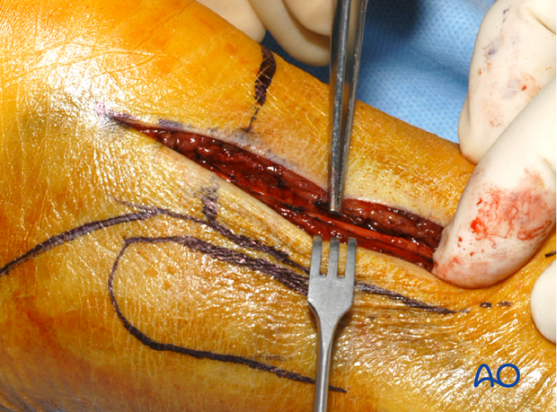

**对腓骨的浅表外科解剖**

如果需要固定腓骨，选择这个选项。应保持全厚浅表瓣以减少皮肤坏死的风险。

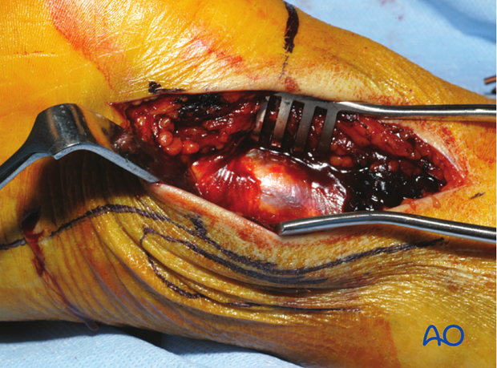

浅表解剖应降至腓骨后外侧边缘的腓骨筋膜的附着点。筋膜被切开，腓骨肌肉向内牵开。

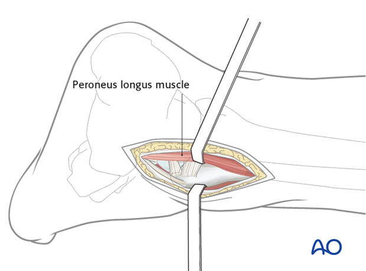

**对腓骨的深外科解剖**

通过释放腓骨筋膜在骨上的后骨膜，完成对腓骨的暴露。

然后可以复位腓骨骨折碎片，保留其软组织附着。腓骨的复位和固定通常在胫骨暴露之前完成。

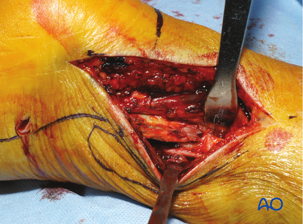

**对胫骨的外科解剖**

通过在腓骨筋膜的后内侧边缘开发的单独平面，可以接触到胫骨。这些现在被向外牵开。

通过在外侧的腓骨肌腱和肌肉与内侧的长屈肌之间开发间隔，实现了对胫骨后部的暴露。

**对胫骨的深外科解剖**

长屈肌（FHL）可以从其肌肉腹部的非常远端识别。也可以通过移动大脚趾来识别。通过对FHL沿其侧面进行锐性解剖，可以通过将这个肌肉向内牵开来暴露整个胫骨后部。这也提供了后内侧神经血管束的保护。

**注意：在这部分暴露中，可能会损伤腓骨动脉和静脉，或其重要分支。如果使用止血带，建议在关闭这一层之前放气止血带，以确保已经实现止血。**

可视化关节表面或防止关节片段复位的小碎片可能很困难。

后外侧碎片围绕通常完整的后胫腓韧带向外侧旋转。开发骨碎片之间的间隔，进入骨折中心。

通过俯卧位，这种暴露可以与胫骨的内侧暴露结合使用，而无需重新定位患者。然而，有时需要通过单独的小切口暴露前内侧或前外侧碎片。一旦通过膝关节屈曲至少90度完成了后胫骨的临时固定和稳定，就可以实现对关节前部的访问。这有时也有助于放置复位钳作为手术程序的一部分。

###  8：胫骨的安全区域
对于在骨干下半部分插入胫骨Schanz螺钉，在矢状面从内侧到冠状面的广泛安全区域中，这些螺钉通常被矢状面插入。

注意不要过度穿透后皮质，因为这会伤害到胫后肌，甚至危及后神经血管束。

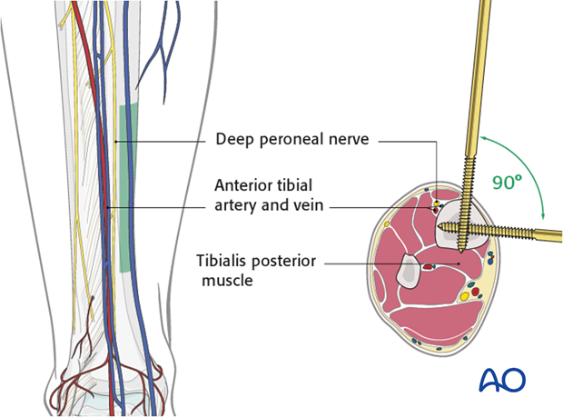

当在远端区域插入Schanz螺钉时，考虑前胫动脉和静脉的位置。在这个区域经皮插入Schanz螺钉是危险的。最小的切口将允许准备和安全插入。

在这个水平的Schanz螺钉应该像插图中所示的那样从前面到后面插入。使用小牵开器保护神经血管结构和伸肌腱。

第二个Schanz螺钉可以从内侧到外侧，位于胫前肌腱的内侧插入。

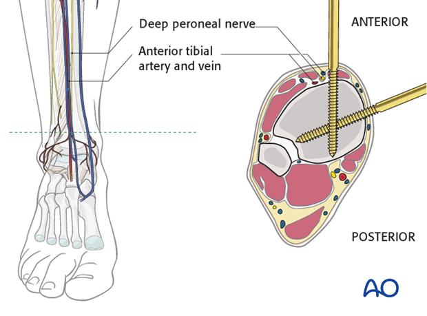

### 远端胫骨的横穿

当在远端区域插入针时，考虑前胫动脉和静脉的位置。在这个区域经皮插入针是危险的。最小的切口将允许准备和安全插入。

腓骨肌腱位于腓骨的后外侧边缘非常近，因此如果朝这个方向插入针，则处于风险中。

第一个针应该从外侧到内侧通过胫骨的中间插入，位于腓骨的前面。第二个针应该从后外侧到前内侧，通过腓骨的中间插入。第三个针应该从后内侧（位于胫后腱的前面）到前外侧插入。

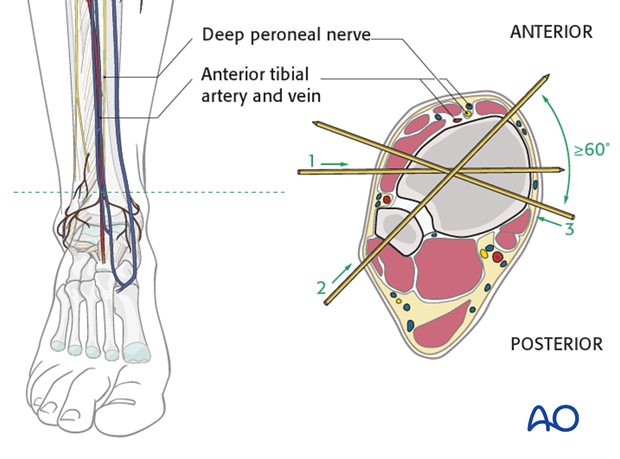

术中应仔细检查针，因为肌腱甚至神经血管结构经常在插入过程中被刺穿。因此，建议使用切口与组织扩张来暴露骨头。识别肌腱刺穿需要术中更换针以避免感染，并促进早期运动。

避免将导线插入关节内，以减少关节感染的风险。插入在关节表面近端不到20毫米的针有穿透关节囊的风险。

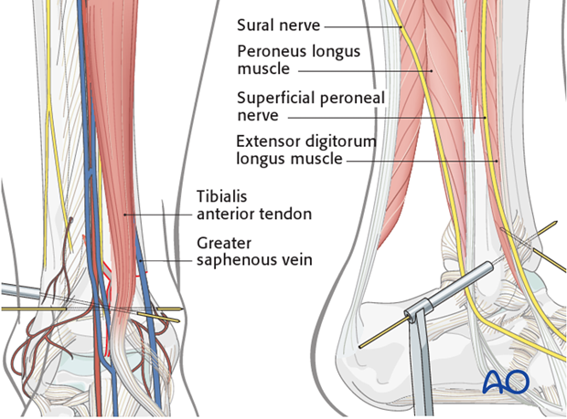

一个5毫米的Schanz螺钉从内侧到外侧插入跟骨结节，最小化了内侧踝后神经血管结构（胫后动脉和内侧和外侧跖神经，以及内侧跟骨神经）的风险。如果肿胀允许，定位胫后动脉搏动：如果无法确定地触摸到，检查未受伤腿部的脉搏，并使用其位置作为受伤侧束的可能路径的指南。

安全区域在图中所示的绿色虚线后面。

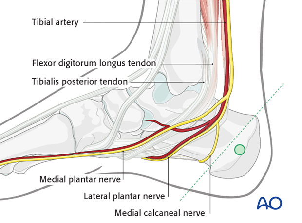

一个小型Schanz螺钉（4毫米）可以放置在第二跖骨中。然而，记住背动脉和静脉和深腓神经位于第二跖骨基底的内侧。这里插入的针需要钝性解剖到骨头，并小心牵开。

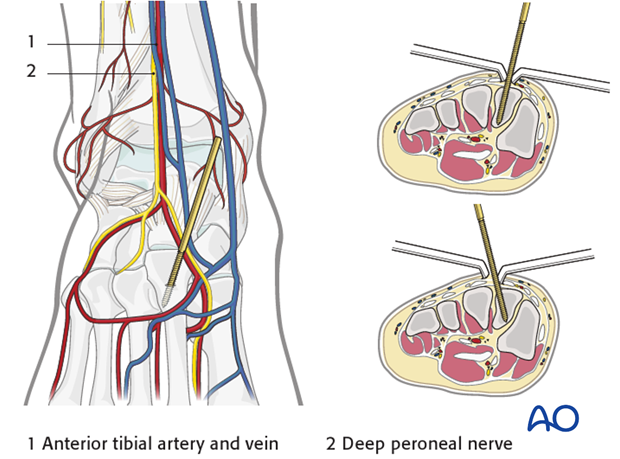

或者，一个小型Schanz螺钉（4毫米）可以放置在第一和第四跖骨中，以控制足部位置，防止马蹄内翻。应该避免伸肌腱。过度穿透足底皮质可能会危及重要的足底结构：小心插入螺钉。

###  9：远端胫骨的钉有限开放入路
从髌骨下极到胫骨粗隆进行纵向皮肤切口。切口集中在髌韧带上。

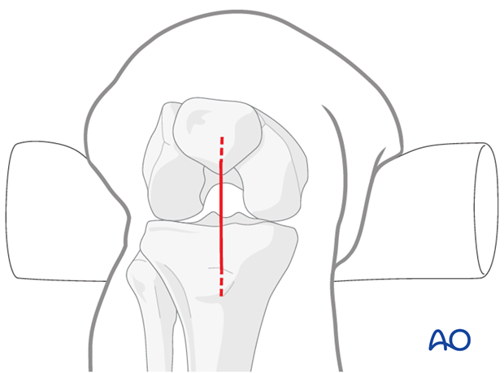

髌韧带可以中间劈开，或者在分开内侧或外侧的筋膜后牵开。入口点应集中在胫骨髓腔上。

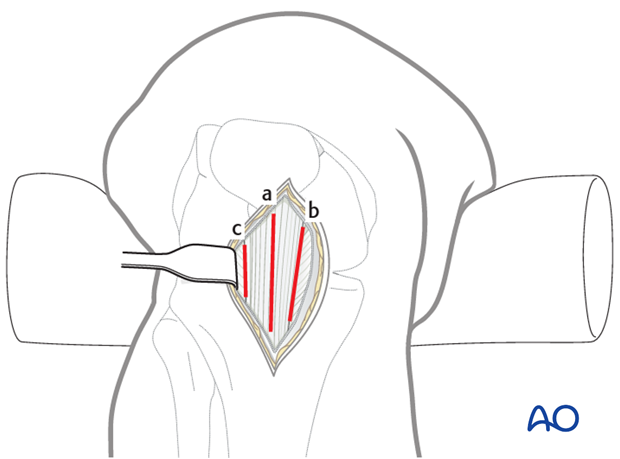

确定胫骨平台的前缘。将髌骨后脂肪垫从胫骨释放并向后移动，不打开膝关节。

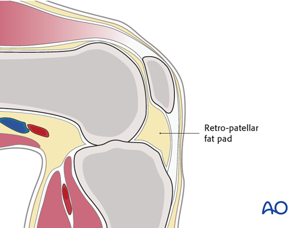

钉入口点在侧视图上，根据钉设计而变化。

必须仔细考虑所选钉的建议。入口点越近端，就越不可能因锉削而造成大的前胫骨缺损。

钉必须清除髌骨，但不能穿透后胫骨皮质。它首先稍微向后瞄准，但然后沿着髓腔重新定向。

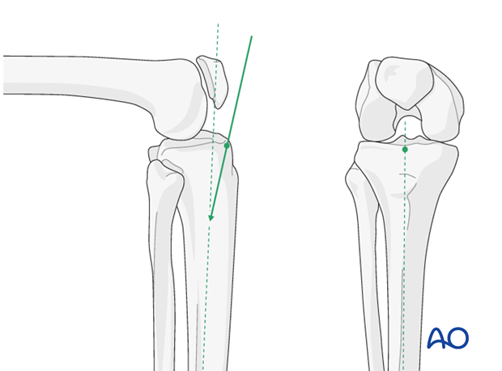

**入口点位置**

钉入口点位于胫骨平台前缘，错过半月板，并在前后视图上居于髓腔中心。

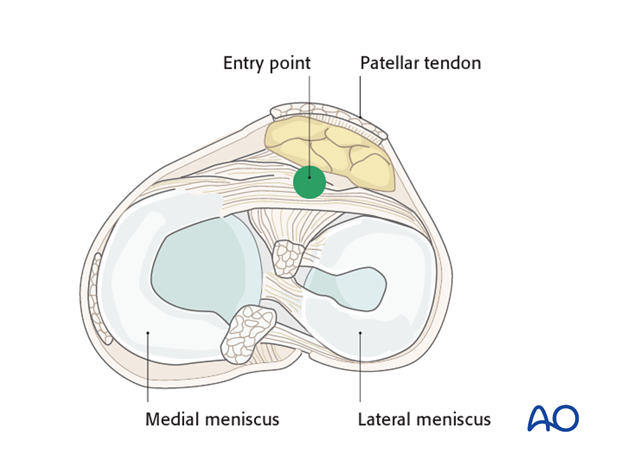

**入口点透视**

入口点在前后透视视图上位于外侧胫骨棘的内侧。

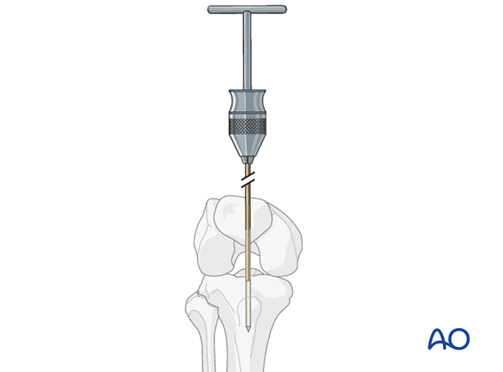

有多种工具可用于打开皮质。可以在导线或针上插入空心钻或空心切割工具。或者，可以根据外科医生的偏好使用弯曲的入口点锥。初始放置导线允许在进入骨头之前进行放射学确认。

**插入中心针**

（用于空心切割器）插入4毫米中心针（Steinmann针），并将其远端传递，角度为15°，在矢状平面上与胫骨轴的角度，进入髓腔近端。在冠状平面上，针与胫骨轴的角度一致。

应在两个平面上通过影像强化进行验证。

**用切割器打开髓腔**

将空心切割器插入中心针上。手动推进切割器并旋转，以移除松质骨核心，直到进入髓腔。保护套可能用于防止损伤髌韧带。

**替代方案：用锥打开髓腔**

将锥的尖端压入入口点的皮质，瞄准后方，并推进它，来回转动锥。锥应该保持在前皮质后方，并在前后视图上居中，瞄准髓腔。逐渐旋转锥以使其与侧视图上运河中心对齐。

锥的轴应该与胫骨前皮质平行。

用牵开器保护髌韧带。

# 

来源：https://surgeryreference.aofoundation.org/


```
翻译并提取图片：

https://surgeryreference.aofoundation.org/orthopedic-trauma/adult-trauma/distal-tibia/approach/anteromedial-or-anterolateral-approach

https://surgeryreference.aofoundation.org/orthopedic-trauma/adult-trauma/distal-tibia/approach/anterolateral-approach-to-the-distal-tibia

https://surgeryreference.aofoundation.org/orthopedic-trauma/adult-trauma/distal-tibia/approach/anteromedial-approach-to-the-distal-tibia

https://surgeryreference.aofoundation.org/orthopedic-trauma/adult-trauma/distal-tibia/approach/posteromedial-approach-to-the-distal-tibia

https://surgeryreference.aofoundation.org/orthopedic-trauma/adult-trauma/distal-tibia/approach/minimally-invasive-approach-to-the-distal-tibia

https://surgeryreference.aofoundation.org/orthopedic-trauma/adult-trauma/distal-tibia/approach/medial-approach-to-the-distal-tibia

https://surgeryreference.aofoundation.org/orthopedic-trauma/adult-trauma/distal-tibia/approach/posterolateral-limited-open-approach-to-the-distal-tibia

https://surgeryreference.aofoundation.org/orthopedic-trauma/adult-trauma/distal-tibia/approach/safe-zones

https://surgeryreference.aofoundation.org/orthopedic-trauma/adult-trauma/distal-tibia/approach/nailing-limited-open-approach-to-the-distal-tibia
```

