# AO Surgery Reference：胫骨近端入路

## All approaches to the proximal tibia

> AO Surgery Reference is a resource for the management of fractures,  based on current clinical principles, practices and available evidence.

### 1：近端胫骨的前外侧入路
在髌骨外侧做一个直切口。

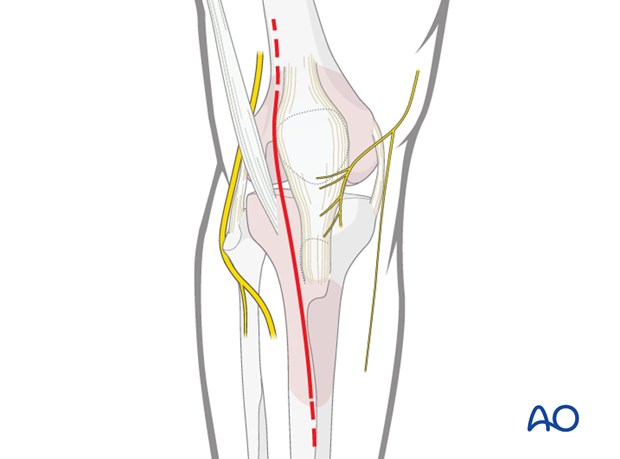

打开髂胫束前部的深筋膜。

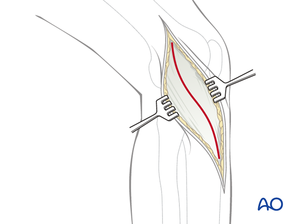

释放胫前肌的近端附着点。如有必要，通过切开髂胫束或从Gerdy结节取一小块骨头来释放。

避免触及位于股二头肌腱附着于腓骨头后的腓总神经。

**警告**

不要试图从前外侧入路暴露胫骨的后内侧。

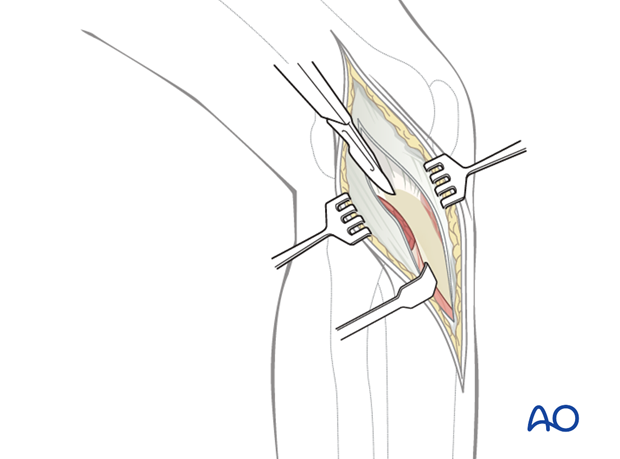

为了暴露关节，在半月板深缘和胫骨之间做一个水平的关节囊切开。在闭合时，半月板和关节囊的重新附着是强制性的。

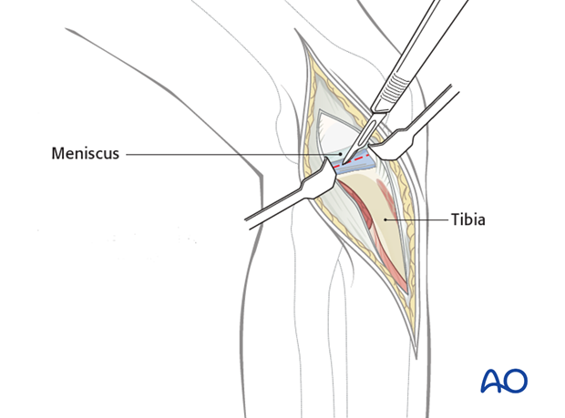

关闭髂胫束，如有必要重新附着Gerdy结节。不要关闭筋膜以避免室间隔综合征。以常规方式关闭剩余的软组织。

### 2：近端胫骨的内侧/后内侧入路
**患者体位**

如果患者的髋关节正常，将患者置于仰卧位，外展并外旋腿部，使其呈数字4形状。如果髋关节僵硬，将患者置于侧卧位，受伤的肢体在下。

膝关节微屈，从内侧上髁向胫骨后内侧边缘做一直线或略微弯曲的切口。根据虚线所示，切口可以向上下延伸，视需要而定。

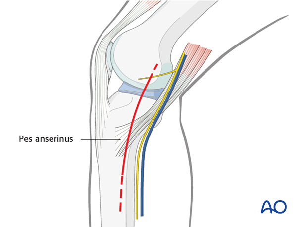

临床图片显示后内侧入路的皮肤切口。

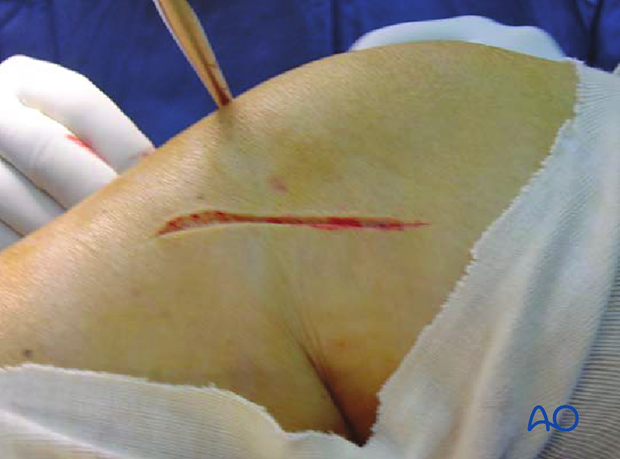

打开筋膜后，识别并暴露腘肌腱群。

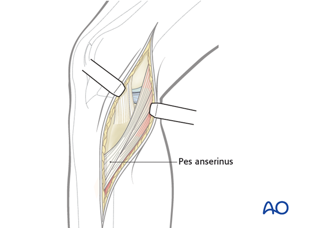

**接近胫骨平台内侧边缘**

将腘肌腱群向前牵开，腓肠肌向后和向下牵开。识别胫骨平台的内侧边缘。

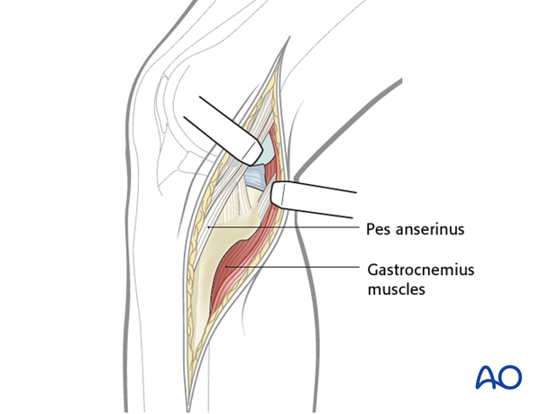

**打开膝关节**

识别半月板，并在半月板与胫骨平台边缘之间切开关节囊，从而进入膝关节。

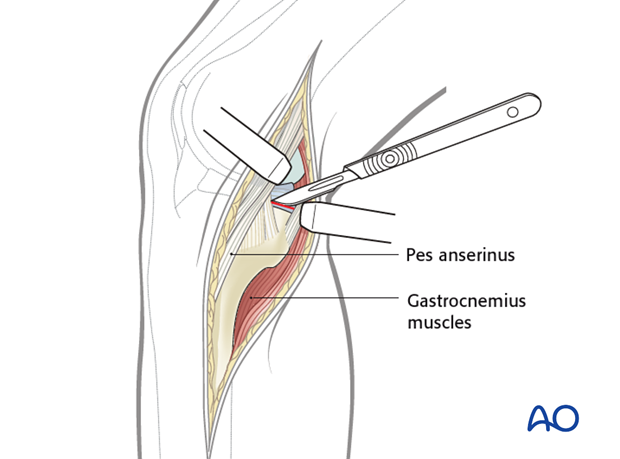

通过皮下解剖向前，可以暴露胫骨近端的前内侧部分（内侧柱）。在处理这部分的骨折时，可以将腘肌腱群向后牵开。

临床图片显示内侧平台和内侧半月板，腘肌腱群和远端的腓肠肌。

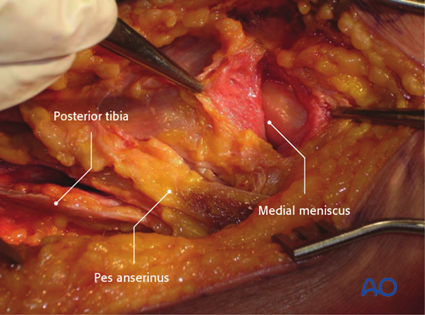

关闭关节囊。如有必要，插入吸引引流管，并以常规方式关闭软组织。

### 3：近端胫骨的后侧入路
后内侧可以不暴露和解剖神经血管结构进行入路。这种方法允许修复后交叉韧带的撕脱骨折和近端胫骨头的切线骨折。

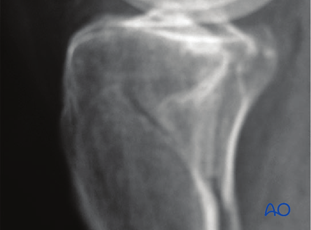

患者俯卧位，在腘窝做一个懒S形皮肤切口。

切口应从关节线向上下延伸约8厘米。

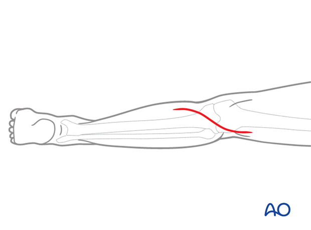

打开小腿筋膜。识别并保留小隐静脉和内侧腓肠神经。

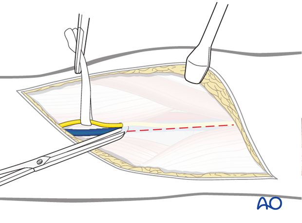

识别半膜肌并将其向内牵开。腓肠肌内侧头的附着点变得可见。

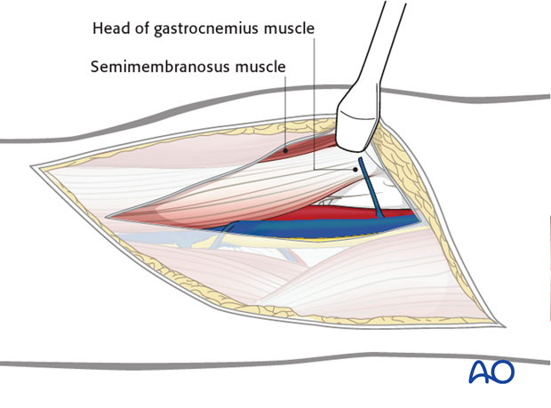

识别腓肠肌的前缘并靠近其附着点切断，将释放的肌肉向外侧牵开。肌肉将保护重要的神经血管束。

后内侧关节囊进入视野。必要时可以切开以暴露骨折线。

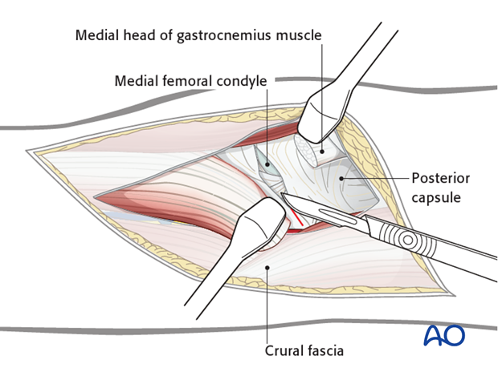

重新附着腓肠肌内侧头。放置深部吸引引流管。按常规关闭软组织。

### 4：近端胫骨微创内固定（MIO）入路
关节复位必须通过关节镜检查，因为关节不能直接通过微创入路的小切口直接观察。

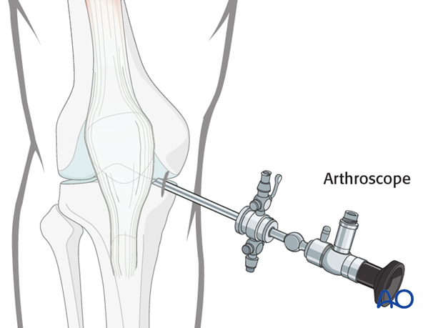

_AO教学视频：MIO胫骨，近端_

识别Gerdy结节。从Gerdy结节后部开始做一个大约5厘米长的直切口，并向远端和前部延伸。

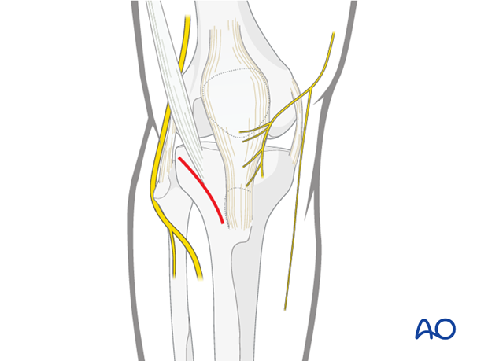

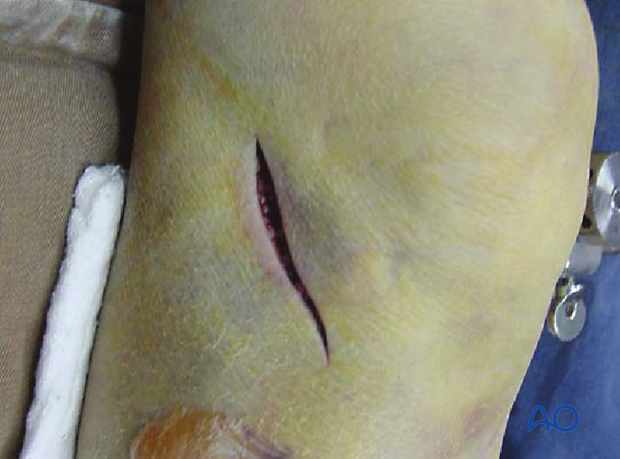

从Gerdy结节开始打开深筋膜，并向下延伸。通过释放胫前肌的前附着点暴露骨头。

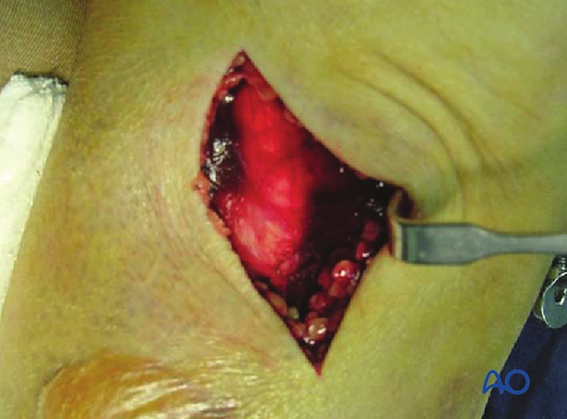

为了控制关节复位，通过内侧入口插入关节镜。不能通过微创入路的小外侧切口进行足够的关节切开。

为了避免室间隔综合征，不要关闭筋膜。以常规方式关闭软组织。

### 5：胫骨针放置的安全区域
确保避免膝关节周围的神经血管结构（腓总神经、腓深神经和腘动脉）。

安全区域指的是这样放置细线，以避免神经血管结构和关节内放置，以最小化化脓性关节炎的可能性。

### 下肢

**腓总神经**

腓总神经始于大腿后部，与股二头肌腱一起从腘窝中心向外侧和前侧运行，并在腓骨颈前部绕过，然后分为前侧感觉和深部运动和感觉分支。损伤此神经会导致严重的功能缺陷。

**隐神经**

隐神经纯属感觉神经。它在大腿前内侧向下运行，并在髌骨内侧的膝关节处发出下髌枝。在踝部，它位于内踝前方，与大隐静脉一起运行。损伤此神经不会导致功能缺陷，但会导致感觉丧失和神经瘤形成。

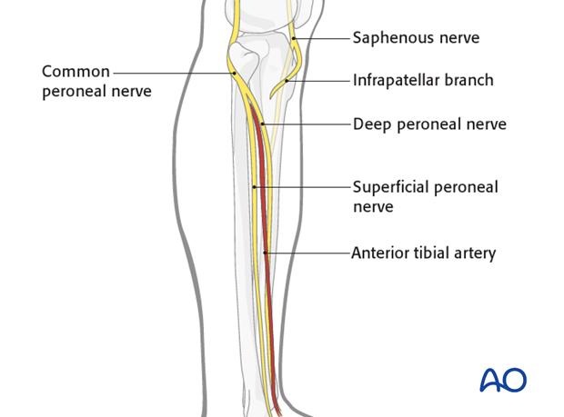

**腘动脉**

腘动脉穿过腘窝中心。它在近端胫骨骨干水平分为胫前动脉，该动脉进入前室，仅在肌间隔膜上方，腓动脉或腓深动脉，以及胫后动脉。

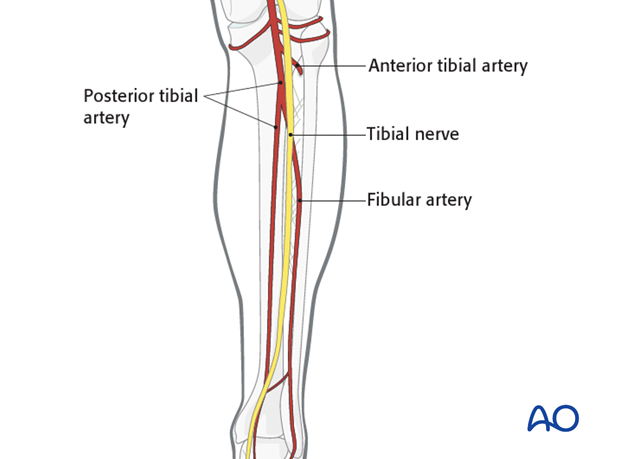

**解剖**

股骨骨干被厚厚的肌肉包绕。主要的神经血管结构位于内侧和后侧，因此可以安全地通过股骨的前外侧区域进行入路。

**肢体的总体神经血管状况**

对于针插入，必须考虑股骨干的软组织包膜的状况（应避免压碎伤或广泛软组织损伤的区域，以最小化随后针道感染的风险）。

**安全区域**

针插入的最安全的解剖区域是股骨的前外侧和直接外侧区域。参见各自区域的肌肉群和神经血管束的解剖位置。

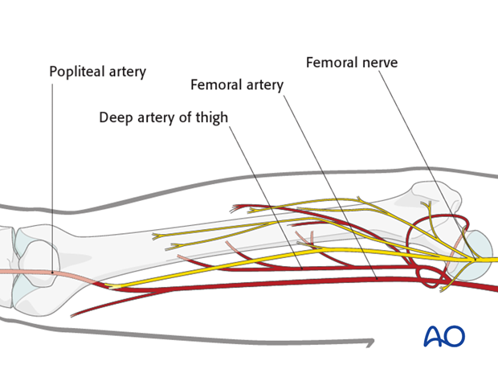

### 针插入（外固定器）

**针插入位置**

外固定器的针插入位置必须根据指示的外固定器类型进行选择。

**桥接外固定器**

对于桥接外固定器，针被放置在股骨和胫骨骨干的前侧。

**非桥接外固定器**

对于非桥接外固定器，针只放置在胫骨。

**针插入深度**

针必须足够深地插入以连接远侧皮质。在远侧皮质，针不得突出，以免损伤神经血管束或软组织。

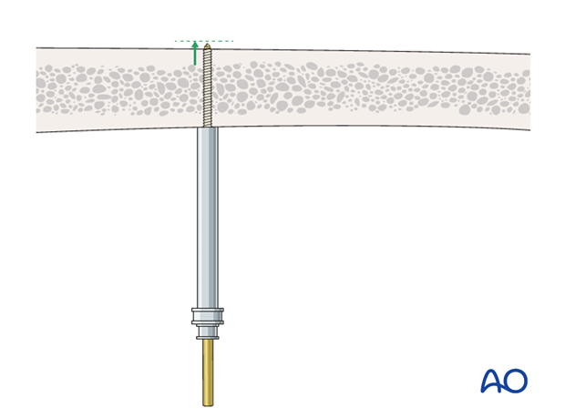

### 6：膝关节关节镜入路
关节镜入路仅推荐用于年轻患者的最小或非移位骨折。必须具备高级的关节镜手术经验。

识别位于髌腱旁边的外侧软点。

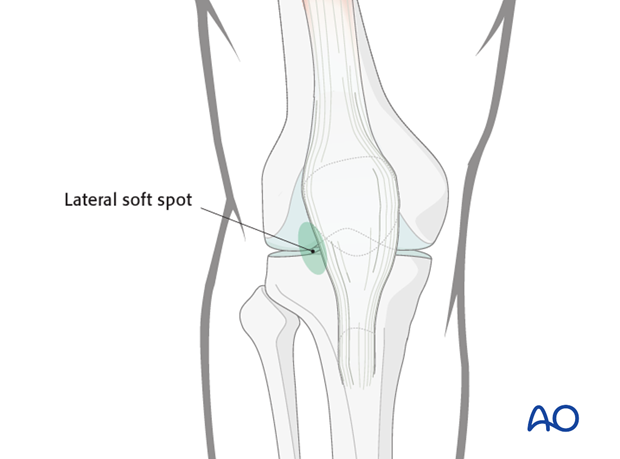

做一个5毫米的刺戳切口，小心插入关节镜轴，以免损伤关节内软骨表面。

接下来，取出套管，插入关节镜。

冲洗膝关节腔，直到清晰可见。

持续正压泵灌注是必要的，为了防止持续出血，保持50-60 mmHg的压力。需要高流量，并且可以向生理盐水中添加肾上腺素以收缩血管。

关节镜入路始终需要对膝关节进行全面的关节内检查，以避免遗漏半月板撕裂和韧带损伤，以及骨软骨碎片骨折。

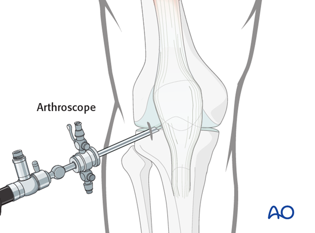

识别位于髌腱旁边的内侧软点，并在关节镜控制下进行触诊。

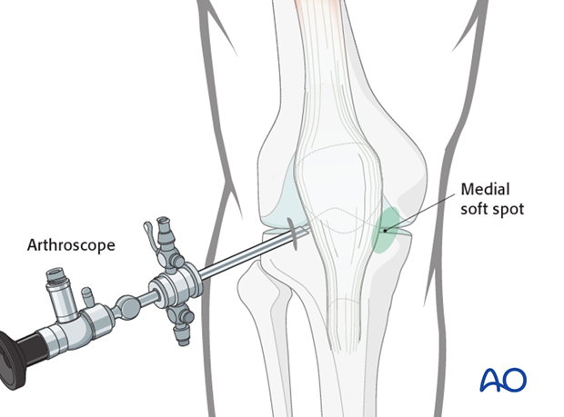

做一个5毫米的刺戳切口，插入关节镜钩。

可以通过内侧入口使用小型复位工具，复位胫骨棘撕脱。

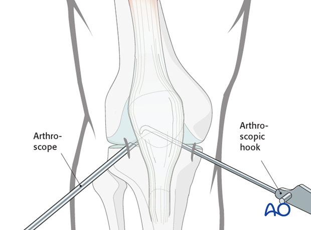

如果需要，做一个小刺戳切口，以便从内侧髌周向近端胫骨逆行引入拉力螺钉。

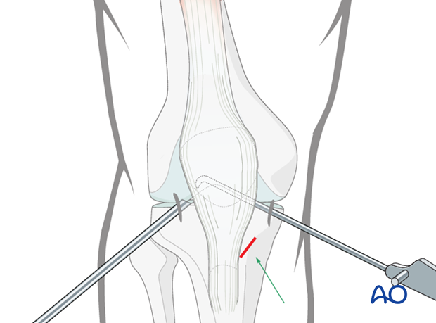

取出关节镜后，通过关节镜轴插入吸引引流管。

以常规方式用缝合线关闭皮肤切口。

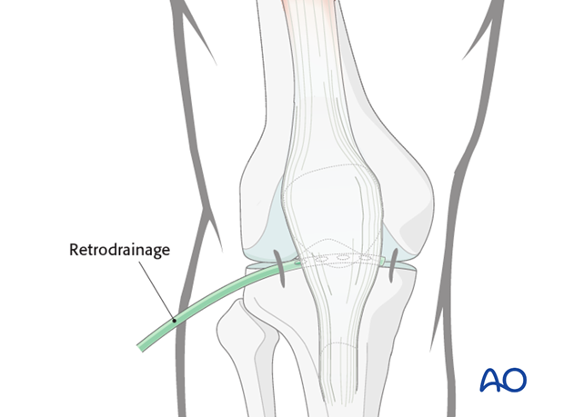

---

```
翻译并提取图片：
https://surgeryreference.aofoundation.org/orthopedic-trauma/adult-trauma/proximal-tibia/approach/anterolateral-approach
https://surgeryreference.aofoundation.org/orthopedic-trauma/adult-trauma/proximal-tibia/approach/medialposteromedial-approach
https://surgeryreference.aofoundation.org/orthopedic-trauma/adult-trauma/proximal-tibia/approach/posterior-approach
https://surgeryreference.aofoundation.org/orthopedic-trauma/adult-trauma/proximal-tibia/approach/approach-for-minimally-invasive-osteosynthesis-mio
https://surgeryreference.aofoundation.org/orthopedic-trauma/adult-trauma/proximal-tibia/approach/safe-zones-for-pin-placement
https://surgeryreference.aofoundation.org/orthopedic-trauma/adult-trauma/proximal-tibia/approach/arthroscopic-approach-to-the-knee
```

```
### 1：近端胫骨的前外侧入路
在髌骨外侧做一个直切口。


打开髂胫束前部的深筋膜。


释放胫前肌的近端附着点。如有必要，通过切开髂胫束或从Gerdy结节取一小块骨头来释放。

避免触及位于股二头肌腱附着于腓骨头后的腓总神经。

**警告**

不要试图从前外侧入路暴露胫骨的后内侧。


为了暴露关节，在半月板深缘和胫骨之间做一个水平的关节囊切开。在闭合时，半月板和关节囊的重新附着是强制性的。


关闭髂胫束，如有必要重新附着Gerdy结节。不要关闭筋膜以避免室间隔综合征。以常规方式关闭剩余的软组织。

### 2：近端胫骨的内侧/后内侧入路
**患者体位**

如果患者的髋关节正常，将患者置于仰卧位，外展并外旋腿部，使其呈数字4形状。如果髋关节僵硬，将患者置于侧卧位，受伤的肢体在下。

膝关节微屈，从内侧上髁向胫骨后内侧边缘做一直线或略微弯曲的切口。根据虚线所示，切口可以向上下延伸，视需要而定。


临床图片显示后内侧入路的皮肤切口。


打开筋膜后，识别并暴露腘肌腱群。


**接近胫骨平台内侧边缘**

将腘肌腱群向前牵开，腓肠肌向后和向下牵开。识别胫骨平台的内侧边缘。


**打开膝关节**

识别半月板，并在半月板与胫骨平台边缘之间切开关节囊，从而进入膝关节。


通过皮下解剖向前，可以暴露胫骨近端的前内侧部分（内侧柱）。在处理这部分的骨折时，可以将腘肌腱群向后牵开。

临床图片显示内侧平台和内侧半月板，腘肌腱群和远端的腓肠肌。


关闭关节囊。如有必要，插入吸引引流管，并以常规方式关闭软组织。

### 3：近端胫骨的后侧入路
后内侧可以不暴露和解剖神经血管结构进行入路。这种方法允许修复后交叉韧带的撕脱骨折和近端胫骨头的切线骨折。


患者俯卧位，在腘窝做一个懒S形皮肤切口。

切口应从关节线向上下延伸约8厘米。


打开小腿筋膜。识别并保留小隐静脉和内侧腓肠神经。


识别半膜肌并将其向内牵开。腓肠肌内侧头的附着点变得可见。


识别腓肠肌的前缘并靠近其附着点切断，将释放的肌肉向外侧牵开。肌肉将保护重要的神经血管束。

后内侧关节囊进入视野。必要时可以切开以暴露骨折线。


重新附着腓肠肌内侧头。放置深部吸引引流管。按常规关闭软组织。

### 4：近端胫骨微创内固定（MIO）入路
关节复位必须通过关节镜检查，因为关节不能直接通过微创入路的小切口直接观察。


_AO教学视频：MIO胫骨，近端_

识别Gerdy结节。从Gerdy结节后部开始做一个大约5厘米长的直切口，并向远端和前部延伸。


从Gerdy结节开始打开深筋膜，并向下延伸。通过释放胫前肌的前附着点暴露骨头。


为了控制关节复位，通过内侧入口插入关节镜。不能通过微创入路的小外侧切口进行足够的关节切开。

为了避免室间隔综合征，不要关闭筋膜。以常规方式关闭软组织。

### 5：胫骨针放置的安全区域
确保避免膝关节周围的神经血管结构（腓总神经、腓深神经和腘动脉）。

安全区域指的是这样放置细线，以避免神经血管结构和关节内放置，以最小化化脓性关节炎的可能性。

### 下肢

**腓总神经**

腓总神经始于大腿后部，与股二头肌腱一起从腘窝中心向外侧和前侧运行，并在腓骨颈前部绕过，然后分为前侧感觉和深部运动和感觉分支。损伤此神经会导致严重的功能缺陷。

**隐神经**

隐神经纯属感觉神经。它在大腿前内侧向下运行，并在髌骨内侧的膝关节处发出下髌枝。在踝部，它位于内踝前方，与大隐静脉一起运行。损伤此神经不会导致功能缺陷，但会导致感觉丧失和神经瘤形成。


**腘动脉**

腘动脉穿过腘窝中心。它在近端胫骨骨干水平分为胫前动脉，该动脉进入前室，仅在肌间隔膜上方，腓动脉或腓深动脉，以及胫后动脉。


**解剖**

股骨骨干被厚厚的肌肉包绕。主要的神经血管结构位于内侧和后侧，因此可以安全地通过股骨的前外侧区域进行入路。

**肢体的总体神经血管状况**

对于针插入，必须考虑股骨干的软组织包膜的状况（应避免压碎伤或广泛软组织损伤的区域，以最小化随后针道感染的风险）。

**安全区域**

针插入的最安全的解剖区域是股骨的前外侧和直接外侧区域。参见各自区域的肌肉群和神经血管束的解剖位置。


### 针插入（外固定器）

**针插入位置**

外固定器的针插入位置必须根据指示的外固定器类型进行选择。

**桥接外固定器**

对于桥接外固定器，针被放置在股骨和胫骨骨干的前侧。

**非桥接外固定器**

对于非桥接外固定器，针只放置在胫骨。

**针插入深度**

针必须足够深地插入以连接远侧皮质。在远侧皮质，针不得突出，以免损伤神经血管束或软组织。


### 6：膝关节关节镜入路
关节镜入路仅推荐用于年轻患者的最小或非移位骨折。必须具备高级的关节镜手术经验。

识别位于髌腱旁边的外侧软点。


做一个5毫米的刺戳切口，小心插入关节镜轴，以免损伤关节内软骨表面。

接下来，取出套管，插入关节镜。

冲洗膝关节腔，直到清晰可见。

持续正压泵灌注是必要的，为了防止持续出血，保持50-60 mmHg的压力。需要高流量，并且可以向生理盐水中添加肾上腺素以收缩血管。

关节镜入路始终需要对膝关节进行全面的关节内检查，以避免遗漏半月板撕裂和韧带损伤，以及骨软骨碎片骨折。


识别位于髌腱旁边的内侧软点，并在关节镜控制下进行触诊。


做一个5毫米的刺戳切口，插入关节镜钩。

可以通过内侧入口使用小型复位工具，复位胫骨棘撕脱。


如果需要，做一个小刺戳切口，以便从内侧髌周向近端胫骨逆行引入拉力螺钉。


取出关节镜后，通过关节镜轴插入吸引引流管。

以常规方式用缝合线关闭皮肤切口。


```

