# 精美解剖图：踝关节韧带

#### Anatomy of the ankle ligaments: a pictorial essay

**踝关节韧带解剖学：一篇图片论文**

> 这是一篇关于踝关节韧带解剖的综述性文章，主要目的是帮助医生更好地理解踝关节韧带的解剖结构，以便对踝关节损伤进行正确的诊断和治疗。踝关节韧带损伤是引起急性踝关节疼痛的最常见原因，而慢性踝关节疼痛通常与踝关节韧带的松弛有关。
>
> 踝关节周围的韧带根据其解剖位置分为三组：外侧韧带、内侧的三角韧带（deltoid ligament），以及连接腿部骨骼（胫骨和腓骨）远端骨骺的胫腓联合韧带。
>
> 各组韧带的具体结构和功能：
>
> 1. **外侧副韧带复合体（LCL）**：包括前胫腓韧带、跟腓韧带和后胫腓韧带。这些韧带在踝关节内翻时最容易受伤，其中前胫腓韧带是最常受伤的韧带。
>
> 2. **内侧副韧带（MCL）**：也称为三角韧带，是一个多束的韧带群，可以分为浅层和深层。这些韧带在踝关节外翻时容易受伤。
>
> 3. **胫腓联合韧带**：包括前下胫腓韧带、后下胫腓韧带和骨间胫腓韧带。这些韧带确保了胫骨和腓骨之间的稳定性，并抵抗试图分离这两块骨头的轴向、旋转和翻译力。
>
> 踝关节扭伤中，前胫腓韧带损伤是踝关节扭伤后最常见的损伤，通常是一个孤立的损伤，但大约20%的患者也会损伤跟腓韧带。扭伤的机制可能会影响损伤的位置，导致前部或后部的损伤，也可能影响到其他结构，如后踝间韧带、距骨颈的骨软骨区域或胫骨前下缘。
>
> 对踝关节韧带解剖的充分了解对于理解踝关节扭伤的基本机制、诊断和治疗至关重要。软组织撞击综合症通常是踝关节扭伤后发生的，根据损伤机制，可能会损伤特定的韧带。
>
> 这篇文章为那些参与诊断和治疗踝关节韧带损伤的医生提供了一个有用的指南。

#### **Abstract摘要**

Understanding the anatomy of the ankle ligaments is important for  correct diagnosis and treatment. Ankle ligament injury is the most  frequent cause of acute ankle pain. Chronic ankle pain often finds its  cause in laxity of one of the ankle ligaments. In this pictorial essay,  the ligaments around the ankle are grouped, depending on their anatomic  orientation, and each of the ankle ligaments is discussed in detail.  
了解踝关节韧带的解剖结构对于正确诊断和治疗很重要。踝关节韧带损伤是急性踝关节疼痛的最常见原因。慢性踝关节疼痛通常归因于其中一条踝关节韧带松弛。在这篇图片文章中，踝关节周围的韧带根据它们的解剖方向进行了分组，并详细讨论了每个踝关节韧带。

---

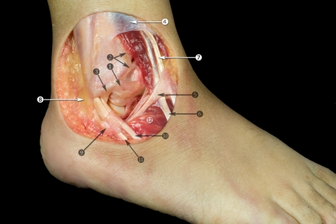

**Fig. 1**    

Anterolateral view of the ankle. Anatomic dissection. *1* Anterior talofibular ligament; *2* anterior tibiofibular ligament; *3* fibular insertion of the calcaneofibular ligament; *4* superior extensor retinaculum; *5* inferior extensor retinaculum; *6* peroneus tertius tendon; *7* extensor digitorum longus tendons; *8* superior peroneal retinaculum; *9* inferior peroneal retinaculum; *10* peroneus brevis tendon; *11* peroneus longus tendon; *12* extensor digitorum brevis muscle

图 1

踝关节前外侧观。解剖分离。1 前距腓韧带；2 前胫腓韧带；3 腓骨附着点的跟腓韧带；4 伸肌上支持带；5 伸肌下支持带；6 第三腓骨肌腱；7 趾长伸肌腱；8 腓骨上支持带；9 腓骨下支持带；10 腓骨短肌腱；11 腓骨长肌腱；12 趾短伸肌

---

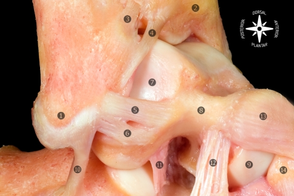

**Fig. 2**    

Osteoarticular anatomic  dissection of the lateral ligaments of the foot and ankle joint. The  anterior talofibular ligament is typically composed of two separate  bands. *1* Tip of the lateral malleolus; *2* tibia; *3* anterior tibiofibular ligament; *4* distal fascicle of the anterior tibiofibular ligament; *5* superior band of the anterior talofibular ligament; *6* inferior band of the anterior talofibular ligament; *7* lateral articular surface of the talus; *8* neck of the talus; *9* head of the talus; *10* calcaneofibular ligament; *11* talocalcaneal interosseous ligament; *12* cervical ligament; *13* talonavicular ligament; *14* navicular

图 2

足踝关节外侧韧带的骨关节解剖分离。前距腓韧带通常由两个独立的束组成。1 腓骨外侧髁尖；2 胫骨；3 前胫腓韧带；4 前胫腓韧带的远端束；5 前距腓韧带的上束；6 前距腓韧带的下束；7 距骨的外侧关节面；8 距骨颈；9 距骨头；10 跟腓韧带；11 距跟骨间韧带；12 颈韧带；13 舟距韧带；14 舟骨

---

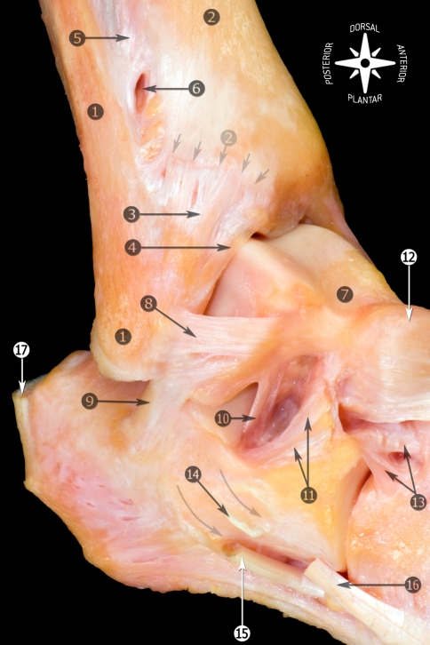

**Fig. 3**    

Anatomic dissection of the  lateral region of the foot and ankle showing the morphology and  relationship of the anterior talofibular with the calcaneofibular  ligaments. *1* Fibula and tip of the fibula; *2* tibia (anterior tubercle with *arrows*); *3* anterior tibiofibular ligament; *4* distal fascicle of the tibiofibular ligament; *5* interosseous membrane; *6* foramen for the perforating branch of the peroneal artery; *7* talus; *8* anterior talofibular ligament; *9* calcaneofibular ligament; *10* talocalcaneal interosseous ligament; *11* inferior extensor retinaculum (cut); *12* talonavicular ligament; *13* bifurcate ligament; *14* peroneal tubercle (*arrows* showing the peroneal tendons sulcus); *15* peroneus longus tendon; *16* peroneus brevis tendon; *17* calcaneal tendon

图 3

足踝关节外侧区域的解剖分离，显示前距腓韧带与跟腓韧带的形态和关系。1 腓骨及其尖端；2 胫骨（带箭头的前结节）；3 前胫腓韧带；4 胫腓韧带的远端束；5 骨间膜；6 腓动脉穿支的孔；7 距骨；8 前距腓韧带；9 跟腓韧带；10 距跟骨间韧带；11 趾短伸肌支持带（已切断）；12 舟距韧带；13 分叉韧带；14 腓骨结节（箭头显示腓骨肌腱沟）；15 腓骨长肌腱；16 腓骨短肌腱；17 跟腱

---

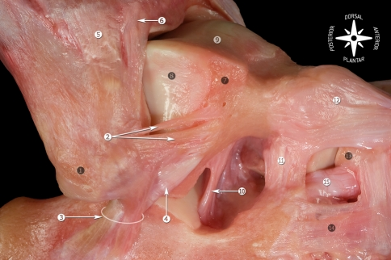

**Fig. 4**    

Anatomic dissection of the  lateral ankle ligaments showing the relationship of the calcaneofibular  and lateral talocalcaneal ligaments with the morphology of the anterior  talofibular ligament. Some authors describe a third band of the anterior talofibular ligament. We have never found this third band in our  dissections. In the presented dissection, the superior band of the  anterior talofibular ligament is smaller than usually. *1* Tip of the fibula; *2* superior and inferior bands of the anterior talofibular ligament; *3* calcaneofibular ligament; *4* lateral talocalcaneal ligament; *5* anterior tibiofibular ligament; *6* distal fascicle of the anterior tibiofibular ligament; *7* triangular region of the talus; *8* lateral articular surface of the talus; *9* dorsal articular surface of the talus; *10* talocalcaneal interosseous ligament; *11* cervical ligament; *12* talonavicular ligament; *13* navicular; *14* lateral calcaneocuboid ligament; *15* bifurcate ligament (calcaneonavicular fascicle)

图 4

踝关节外侧韧带的解剖分离，显示跟腓韧带与距骨外侧韧带与前距腓韧带形态的关系。一些作者描述了前距腓韧带的第三束。我们在解剖中从未发现这个第三束。在展示的分离中，前距腓韧带的上束比通常小。1 腓骨尖；2 前距腓韧带的上束和下束；3 跟腓韧带；4 距骨外侧韧带；5 前胫腓韧带；6 前胫腓韧带的远端束；7 距骨的三角区域；8 距骨的外侧关节面；9 距骨的背侧关节面；10 距跟骨间韧带；11 颈韧带；12 舟距韧带；13 跟骨外侧韧带；14 分叉韧带（跟舟束）

---

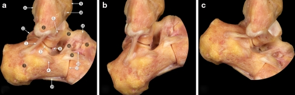

**Fig. 5**    

Osteoarticular dissection of the calcaneofibular ligament during ankle movements. **a** Neutral position. **b** Dorsal flexion. **c** Plantar flexion. Calcaneofibular ligament becomes horizontal during  plantar flexion and vertical in dorsal flexion, remaining tensed  throughout the entire arc of motion of the ankle. *1* Calcaneofibular ligament; *2* tip of the fibula; *3* calcaneus; *4* peroneal tubercle; *5* subtalar joint; *6* anterior talofibular ligament; *7* neck of the talus; *8* talocalcaneal interosseous ligament; *9* anterior tubercle of the tibia; *10* anterior tibiotalar ligament; *11* posterior tubercle of the tibia; *12* lateral talar process; *13* calcaneocuboid joint; *14* lateral calcaneocuboid ligament; *15* talonavicular ligament; *16* cervical ligament; *17* navicular; *18* bifurcate ligament (calcaneonavicular fascicle); *19* long plantar ligament

图 5

踝关节运动中跟腓韧带的骨关节解剖分离。a 中立位置。b 背屈。c 跖屈。跟腓韧带在跖屈时变得水平，在背屈时变得垂直，在整个踝关节运动的弧线上保持紧张。1 跟腓韧带；2 腓骨尖；3 跟骨；4 腓骨结节；5 距下关节；6 前距腓韧带；7 距骨颈；8 距跟骨间韧带；9 胫骨前结节；10 胫距前韧带；11 胫骨后结节；12 距骨外侧突；13 跟骰关节；14 跟骰韧带；15 舟距韧带；16 颈韧带；17 舟骨；18 分叉韧带（跟舟束）；19 长跖韧带

---

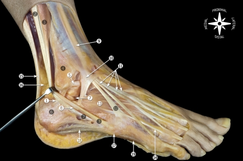

**Fig. 6**    

Anatomic dissection showing the relationship of the calcaneofibular ligament with peroneal tendons. *1* Calcaneofibular ligament; *2* peroneus longus tendon; *3* peroneus brevis tendon; *4* fibula; *5* talofibular ligament; *6* calcaneus; *7* subtalar joint; *8* septum in the peroneal tubercle; *9* superior extensor retinaculum; *10* inferior extensor retinaculum; *11* extensor digitorum longus tendons; *12* peroneus tertius tendon; *13* extensor digitorum brevis; *14* extensor digitorum brevis tendon; *15* calcaneal tendon; *16* Kager’s fat pad; *17* tuberosity of the fifth metatarsal bone; *18* lateral plantar fascia; *19* abductor digiti minimi

图 6

解剖分离显示跟腓韧带与腓骨肌腱的关系。1 跟腓韧带；2 腓骨长肌腱；3 腓骨短肌腱；4 腓骨；5 距腓韧带；6 跟骨；7 距下关节；8 腓骨结节的隔；9 伸肌上支持带；10 伸肌下支持带；11 趾长伸肌腱；12 第三腓骨肌腱；13 趾短伸肌；14 趾短伸肌腱；15 跟腱；16 Kager脂肪垫；17 第五跖骨结节；18 腓侧跖筋膜；19 小趾展肌

---

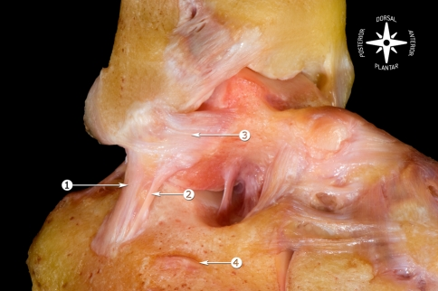

**Fig. 7**    

Osteoarticular dissection. Relationship of the calcaneofibular ligament with the lateral talocalcaneal ligament. *1* Calcaneofibular ligament; *2* lateral talocalcaneal ligament; *3* anterior talofibular ligament; *4* peroneal tubercle

图 7

骨关节解剖分离。跟腓韧带与距骨外侧韧带的关系。1 跟腓韧带；2 距骨外侧韧带；3 前距腓韧带；4 腓骨结节

---

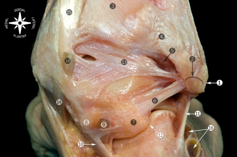

**Fig. 8**    

Posterior view of the anatomic dissection of the ankle ligaments. *1* Tip of the fibula; *2* peroneal groove of the fibula; *3* tibia; *4* superficial component of the posterior tibiofibular ligament; *5* deep component of the posterior tibiofibular ligament or transverse ligament; *6* posterior calcaneofibular ligament; *7* lateral talar process; *8* medial talar process; *9* tunnel for flexor hallucis longus tendon; *10* flexor hallucis longus retinaculum; *11* calcaneofibular ligament; *12* subtalar joint; *13* posterior intermalleolar ligament; *14* flexor digitorum longus tendon (cut); *15* tibialis posterior tendon; *16* peroneal tendons

图 8

踝关节韧带的解剖分离的后视图。1 腓骨尖；2 腓骨的腓骨沟；3 胫骨；4 后胫腓韧带的浅层；5 后胫腓韧带的深层或横韧带；6 后跟腓韧带；7 距骨外侧突；8 距骨内侧突；9 屈肌长屈肌腱的通道；10 屈肌长屈肌腱支持带；11 跟腓韧带；12 距下关节；13 后胫腓间韧带；14 趾长屈肌腱（已切断）；15 胫骨后肌腱；16 腓骨肌腱

---

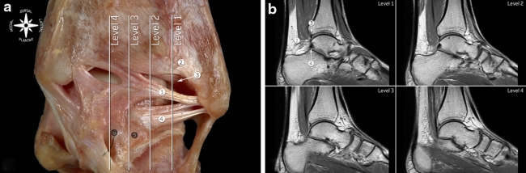

**Fig. 9**    

**a** Posterior view of the  ankle ligaments showing the relationships of the posterior  intermalleolar ligament, posterior talofibular ligament and transverse  ligament. **b** T1-weighted spin-echo MR imaging showing the correlation between MRI and the saggital cuts in **a**. *1* Posterior intermalleolar ligament; *2* superficial component of the tibiofibular ligament; *3* deep component of the tibiofibular ligament or transverse ligament; *4* posterior talofibular ligament; *5* lateral talar process; *6* tunnel for flexor hallucis longus tendon

图 9

a 踝关节韧带的后视图，显示后胫腓间韧带、后距腓韧带和横韧带的关系。b T1加权自旋回波MR成像显示MRI与a中的矢状切面之间的相关性。1 后胫腓间韧带；2 胫腓韧带的浅层；3 胫腓韧带的深层或横韧带；4 后距腓韧带；5 距骨外侧突；6 屈肌长屈肌腱的通道

---

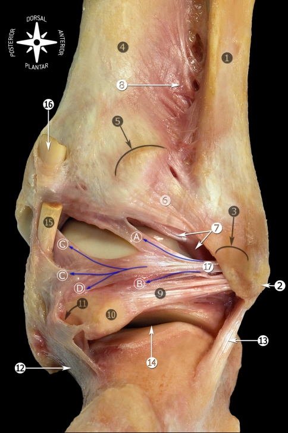

**Fig. 10**    

Posterior view of the anatomic  dissection of the ankle ligaments showing the posterior intermalleolar  ligament with its relation to the surrounding anatomy. *1* Fibula; *2* tip of the fibula; *3* peroneal groove of the fibula; *4* tibia; *5* posterior tubercle of the tibia; *6* superficial component of the posterior tibiofibular ligament; *7* deep component of the posterior tibiofibular ligament or transverse ligament; *8* interosseous membrane; *9* posterior talofibular ligament; *10* lateral talar process; *11* tunnel for flexor hallucis longus tendon; *12* flexor hallucis longus retinaculum; *13* calcaneofibular ligament; *14* subtalar joint; *15* flexor digitorum longus tendon (cut); *16* tibialis posterior tendon (cut); *17* posterior intermalleolar ligament: *A* Tibial insertion (tibial slip in arthroscopic view). *B* Talar insertion (lateral talar process). *C* Tibial malleolar insertion through the septum between the flexor digitorum longus and posterior tibial tendons. *D* Talar insertion (medial talar process) through the joint capsule

图 10

踝关节韧带的解剖分离的后视图，显示后胫腓间韧带及其与周围解剖的关系。1 腓骨；2 腓骨尖；3 腓骨的腓骨沟；4 胫骨；5 胫骨后结节；6 后胫腓韧带的浅层；7 后胫腓韧带的深层或横韧带；8 骨间膜；9 后距腓韧带；10 距骨外侧突；11 屈肌长屈肌腱的通道；12 屈肌长屈肌腱支持带；13 跟腓韧带；14 距下关节；15 趾长屈肌腱（已切断）；16 胫骨后肌腱（已切断）；17 后胫腓间韧带：A 胫骨附着部（关节镜视图中的胫骨滑片）。B 距骨附着部（距骨外侧突）。C 通过趾长屈肌与胫骨后肌腱之间的隔膜的胫骨踝部附着部。D 通过关节囊的距骨附着部（距骨内侧突）

---

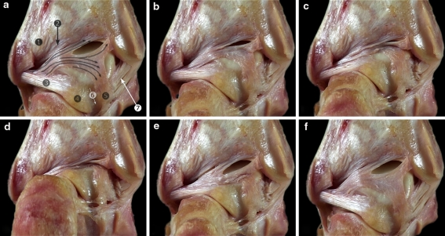

**Fig. 11**    

Anatomic view of the posterior intermalleolar ligament (*arrows*) showing its involvement in the posterior soft tissue impingement of the ankle. From dorsiflexion (**a**) to plantar flexion (**d**), to dorsiflexion (**f**). *1* Superficial component of the posterior tibiofibular ligament; *2* deep component of the posterior tibiofibular ligament or transverse ligament; *3* posterior talofibular ligament; *4* lateral talar process; *5* medial talar process; *6* tunnel for the flexor hallucis longus tendon; *7* deep layer of the medial collateral ligament (deep posterior tibiotalar ligament)

图 11

解剖视图显示后胫腓间韧带（箭头）在踝关节后软组织撞击中的参与。从背屈（a）到跖屈（d），再到背屈（f）。1 后胫腓韧带的浅层；2 后胫腓韧带的深层或横韧带；3 后距腓韧带；4 距骨外侧突；5 距骨内侧突；6 屈肌长屈肌腱的通道；7 内侧副韧带的深层（后胫距韧带）

---

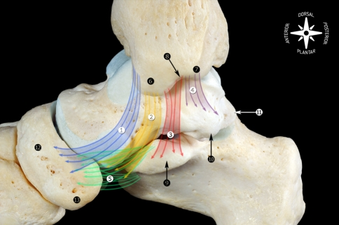

**Fig. 12**    

Schematic representation of the main components of the medial collateral ligament found as frequently  observed in our dissections. The morphology of the medial malleolus is  helpful to understand the origins of the medial collateral ligament. In  the medial view, two areas or segments (culliculi) can be seen,  separated by the intercollicular groove. *1* Tibionavicular ligament; *2* tibiospring ligament; *3* tibiocalcaneal ligament; *4* deep posterior tibiotalar ligament; *5* spring ligament complex (plantar and superomedial calcaneonavicular ligaments); *6* anterior culliculus; *7* posterior culliculus; *8* intercullicular groove; *9* sustentaculum tali; *10* medial talar process; *11* lateral talar process; *12* navicular; *13* navicular tuberosity

图 12

我们经常在解剖中观察到的内侧副韧带的主要组成部分的示意图。内侧踝骨的形态有助于理解内侧副韧带的起源。在内侧视图中，可以看到两个区域或段（culliculi），由间结节沟分隔。1 胫舟韧带；2 胫弹簧韧带；3 胫跟韧带；4 深后胫距韧带；5 弹簧韧带复合体（跖侧和上内侧跟舟韧带）；6 前culliculus；7 后culliculus；8 间结节沟；9 跟骨支撑；10 内侧距突；11 外侧距突；12 舟骨；13 舟骨结节

---

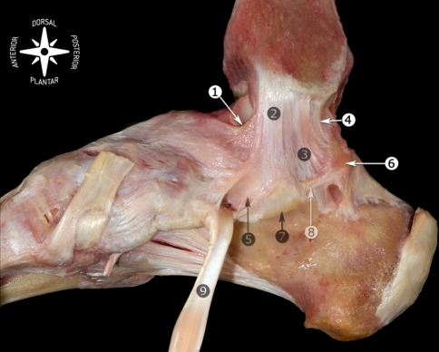

**Fig. 13**    

Medial view of the anatomic dissection of the main components of the medial collateral ligament. *1* Tibionavicular ligament; *2* tibiospring ligament; *3* tibiocalcaneal ligament; *4* deep posterior tibiotalar ligament; *5* spring ligament complex (superomedial calcaneonavicular ligament); *6* medial talar process; *7* sustentaculum tali; *8* medial talocalcaneal ligament; *9* tibialis posterior tendon

图 13

内侧副韧带主要组成部分的解剖分离的内侧视图。1 胫舟韧带；2 胫弹簧韧带；3 胫跟韧带；4 深后胫距韧带；5 弹簧韧带复合体（上内侧跟舟韧带）；6 内侧距突；7 跟骨支撑；8 内侧跟距韧带；9 胫骨后肌腱

---

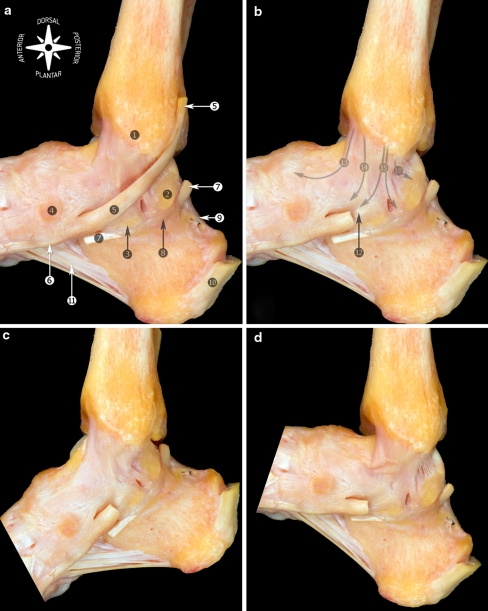

**Fig. 14**    

Medial view of the anatomic  dissection of the medial collateral ligament. Most of the medial  collateral ligament is covered by tendons (tibialis posterior and flexor digitorum longus tendons). In order to see the ligament, the tendon of  flexor digitorum longus was removed. **a** Neutral position showing the relationship with the tibialis posterior tendon. **b** The posterior tibialis tendon was removed. **c** Plantar flexion. The components located anteriorly to the bimalleolar axis are tensed. **d** Dorsiflexion. The components located anteriorly to the bimalleolar axis are relaxed. *1* Medial malleolus; *2* lateral talar process; *3* sustentaculum tali; *4* navicular; *5* tibialis posterior tendon; *6* navicular tuberosity; *7* flexor hallucis longus (cut); *8* flexor hallucis longus retinaculum; *9* posterior talocalcaneal ligament; *10* calcaneal tendon (cut at the level of the insertion); *11* long plantar ligament; *12* spring ligament complex (superomedial calcaneonavicular ligament); *13* tibionavicular ligament; *14* tibiospring ligament; *15* tibiocalcaneal ligament; *16* deep posterior tibiotalar ligament

图 14

内侧副韧带的解剖分离的内侧视图。大部分内侧副韧带被肌腱（胫骨后肌腱和趾长屈肌腱）覆盖。为了观察韧带，趾长屈肌腱被移除。a 中立位置显示与胫骨后肌腱的关系。b 移除了胫骨后肌腱。c 跖屈。位于双踝轴前部的组成部分是紧张的。d  背屈。位于双踝轴前部的组成部分是放松的。1 内踝；2 距骨外侧突；3 跟骨支撑；4 舟骨；5 胫骨后肌腱；6 舟骨结节；7 长屈肌（切断）；8  长屈肌支持带；9 后距跟韧带；10 跟腱（在插入水平处切断）；11 长跖韧带；12 弹簧韧带复合体（上内侧跟舟韧带）；13 胫舟韧带；14  胫弹簧韧带；15 胫跟韧带；16 深后胫距韧带

---

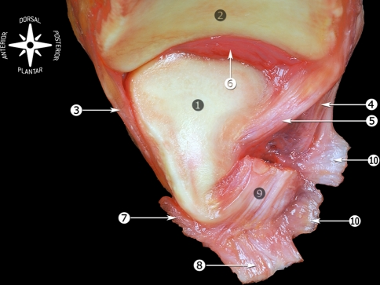

**Fig. 15**    

Medial view of the tibiofibular joint (os talus previously removed). *1* Articular surface of the lateral malleolus; *2* distal articular surface of the tibia; *3* anterior tibiofibular ligament (distal fascicle); *4* superficial component of the posterior tibiofibular ligament; *5* deep component of the posterior tibiofibular ligament or transverse ligament; *6* fatty synovial fringe; *7* anterior talofibular ligament; *8* calcaneofibular ligament; *9* posterior talofibular ligament; *10* fibulotalocalcaneal ligament or Rouvière and Canela ligament

图 15

距胫关节的内侧视图（距骨已预先移除）。1 腓骨外侧髁的关节面；2 胫骨远端关节面；3 前胫腓韧带（远端束）；4 后胫腓韧带的浅层；5 后胫腓韧带的深层或横韧带；6 脂肪性滑膜缘；7 前距腓韧带；8 跟腓韧带；9 后距腓韧带；10 腓骨距跟韧带或Rouvière和Canela韧带

---

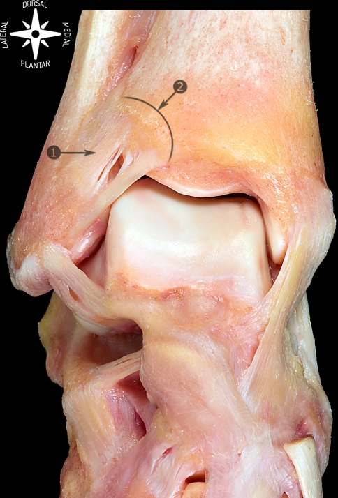

**Fig. 16**    

Anterosuperior view of talocrural joint and dorsum of the foot. *1* Anterior tibiofibular ligament; *2* anterior tubercle of the tibia

图 16

踝关节和足背的前上视图。1 前胫腓韧带；2 胫骨前结节

---

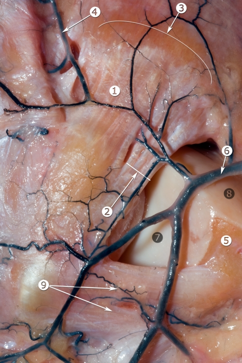

**Fig. 17**  

Anatomic view of the anterolateral part of the ankle  showing the relationship between the anterior tibiofibular ligament and  the perforating branch of the peroneal artery (arteries are filled with *black* latex). *1* Anterior tibiofibular ligament; *2* distal fascicle of the anterior tibiofibular ligament; *3* anterior tubercle of the tibia; *4* perforating branch of peroneal artery; *5* triangular region of the talus; *6* anterior malleolar artery; *7* lateral articular surface of the talus; *8* dorsal articular surface of the talus; *9* anterior talofibular ligament

图 17

踝关节前外侧部分的解剖视图，显示前胫腓韧带与腓动脉穿支（动脉用黑色乳胶填充）之间的关系。1 前胫腓韧带；2 前胫腓韧带的远端束；3 胫骨前结节；4 腓动脉穿支；5 距骨的三角区域；6 前踝动脉；7 距骨的外侧关节面；8 距骨的背侧关节面；9 前距腓韧带

---

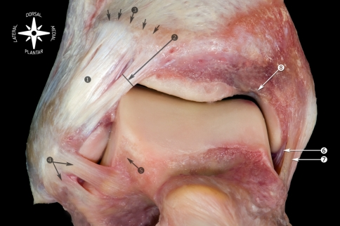

**Fig. 18**    

Anatomic view of the anterior ligaments of the ankle. *1* Anterior tibiofibular ligament; *2* distal fascicle of the anterior tibiofibular ligament; *3* tibia (anterior tubercle indicated with *arrows*); *4* anterior talofibular ligament; *5* beveled triangular region of the talus; *6* deep layer of the medial collateral ligament; *7* superficial layer of the medial collateral ligament; *8* notch of Harty

图 18

踝关节前部韧带的解剖视图。1 前胫腓韧带；2 前胫腓韧带的远端束；3 胫骨（前结节用箭头表示）；4 前距腓韧带；5 距骨的斜面三角区域；6 内侧副韧带的深层；7 内侧副韧带的浅层；8 Harty切迹

---

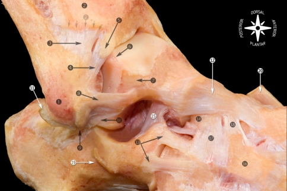

**Fig. 19**    

Osteoarticular anatomic dissection of the ligaments of the foot and ankle joint. *1* Tip of the lateral malleolus; *2* tibia (anterior tubercle indicated with *arrows*); *3* anterior tibiofibular ligament; *4* distal fascicle of the anterior tibiofibular ligament; *5* imaging showing a calcification in the tibial insertion of the distal fascicle of the anterior tibiofibular ligament; *6* abrasion of the joint cartilage in the region where the anterior tibiofibular ligament came into contact with the talus; *7* beveled triangular region of the talus; *8* anterior talofibular ligament; *9* calcaneofibular ligament; *10* lateral talocalcaneal ligament; *11* cartilaginous rim; *12* talonavicular ligament; *13* lateral calcaneocuboid ligament; *14* navicular; *15* cervical ligament; *16* lateral cuneiform; *17* dorsal cuboideonavicular ligament; *18* dorsal cuneonavicular ligament; *19* calcaneus (peroneal tubercle); *20* anterior tibialis tendon

图 19

足踝关节韧带的骨关节解剖分离。1 腓骨外侧髁尖；2 胫骨（前结节用箭头表示）；3 前胫腓韧带；4 前胫腓韧带的远端束；5 影像显示前胫腓韧带远端束的胫骨附着点处的钙化；6 前胫腓韧带与距骨接触区域的关节软骨磨损；7 距骨的斜面三角区域；8 前距腓韧带；9 跟腓韧带；10 距骨外侧韧带；11 软骨缘；12 舟距韧带；13 跟骰韧带；14 舟骨；15 颈韧带；16 外侧楔骨；17 背侧骰舟韧带；18 背侧楔舟韧带；19 跟骨（腓骨结节）；20 胫骨前肌腱

---

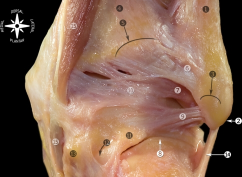

**Fig. 20**    

Anatomic dissection of the posterior ligaments of the ankle. *1* Lateral malleolus; *2* tip of the lateral malleolus; *3* peroneal groove; *4* tibia; *5* posterior tubercle of the tibia; *6* posterior tibiofibular ligament, superficial component; *7* posterior tibiofibular ligament, deep component or transverse ligament; *8* subtalar joint; *9* posterior talofibular ligament; *10* posterior intermalleolar ligament; *11* lateral talar process; *12* tunnel for flexor hallucis longus tendon (tendon was removed); *13* medial talar process; *14* calcaneofibular ligament; *15* flexor digitorum longus

图 20

踝关节后部韧带的解剖分离。1 腓骨外侧髁；2 腓骨外侧髁尖；3 腓骨沟；4 胫骨；5 胫骨后结节；6 后胫腓韧带，浅层；7 后胫腓韧带，深层或横韧带；8 距下关节；9 后距腓韧带；10 后胫腓间韧带；11 距骨外侧突；12 屈肌长屈肌腱的通道（肌腱已移除）；13 距骨内侧突；14 跟腓韧带；15 趾长屈肌

---

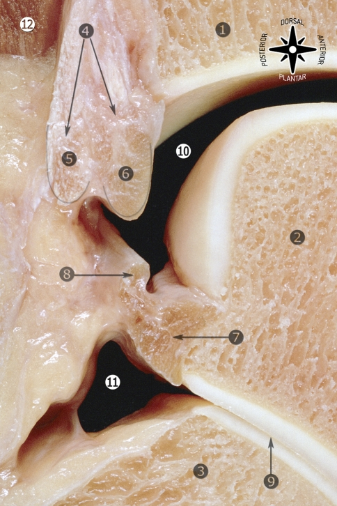

**Fig. 21**    

Sagittal section of the ankle (lateral view). *1* Tibia; *2* talus; *3* calcaneus; *4* posterior tibiofibular ligament; *5* superficial component of the posterior tibiofibular ligament; *6* deep component of the posterior tibiofibular ligament or transverse ligament; *7* posterior talofibular ligament; *8* posterior intermalleolar ligament; *9* subtalar joint; *10* talocrural joint; *11* posterior capsular recess of the subtalar joint; *12* flexor hallucis longus muscle

图 21

踝关节（侧视）的矢状切面。1 胫骨；2 距骨；3 跟骨；4 后胫腓韧带；5 后胫腓韧带的浅层；6 后胫腓韧带的深层或横韧带；7 后距腓韧带；8 后胫腓间韧带；9 距下关节；10 踝关节；11 距下关节后囊隐窝；12 屈肌长屈肌

------

来源：Golanó P, Vega J, de Leeuw PA, Malagelada F, Manzanares MC, Götzens V,  van Dijk CN. Anatomy of the ankle ligaments: a pictorial essay. Knee  Surg Sports Traumatol Arthrosc. 2010 May;18(5):557-69. doi:  10.1007/s00167-010-1100-x. Epub 2010 Mar 23. PMID: 20309522; PMCID:  PMC2855022.

声明：本平台所分享理念、技术、原理，图片，视频，均为公开发行的期刊文献、出版书籍或网络平台资料，版权归原作者所有，平台仅进行整理、归纳并分享，供学习参考。本平台不对内容真实性、技术有效性负责，依据本平台推送内容产生的相关医疗行为，与平台无关，请审慎选择。如有侵权可联系删除。